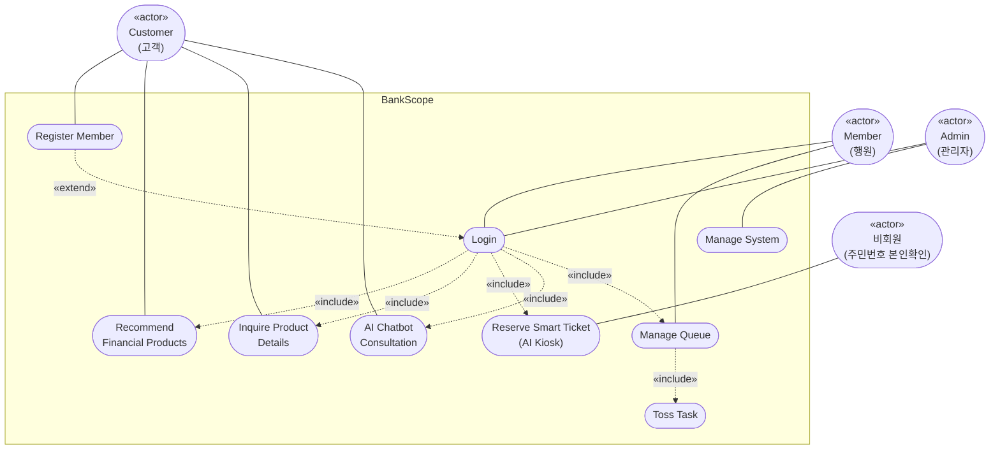

# BankScope

## - Analysis document - 


| | |
|---|---|
| Student No. | 21622137 |
| Name | 최재영 |
| E-mail | silversky621@naver.com |

---

## [ Revision history ]

| Revision date | Version # | Description | Author |
|---|---|---|---|
| 2026.04.28 | 1.0.0 | First Draft | 최재영 |
| 2026.05.20 | 2.0.0 | 실제 구현 및 프로토타이핑 결과를 바탕으로 한 기능 재정의 (RF 22분류, Gemini 챗봇, Admin/Toss 기능 추가 반영) | 최재영 |
| 2026.05.30 | 2.1.0 | Introduction에 추진 배경·문제 정의·프로젝트 목적 반영 (Conceptualization v2.1.0 기준 동기화) | 최재영 |
| 2026.05.30 | 2.2.0 | Use case diagram을 Mermaid flowchart로 전환 | 최재영 |
| 2026.05.30 | 2.3.0 | Use case #3 시나리오 및 Domain Analysis #4 추천 로직 반영 (AI 서버 직접 피처 조회, 나이 필터링, product_id 직접 사용) | 최재영 |
| 2026.05.30 | 2.4.0 | 전체 문서 정합성 수정 (BCrypt/AES 구분, 직접접수 시나리오 추가, 22개 피처 명세, Glossary 갱신) | 최재영 |

---

## = Contents =

1. Introduction
2. Use case analysis
3. Domain Analysis
4. User Interface prototype
5. Glossary
6. References

---

## 1. Introduction

### 1) Summary

한국 금융 산업은 코로나19 이후 디지털 전환이 가속화되면서 모바일 앱 중심의 비대면 채널이 표준으로 자리잡았다. 그러나 이 과정에서 노령층·장애인·외국인 등 디지털 취약계층이 금융 서비스에서 구조적으로 배제되는 '디지털 디바이드(Digital Divide)' 문제가 심화되고 있다. 오프라인 영업점에서도 기존 키오스크의 복잡성, 잘못된 창구 배정, AI 추천 알고리즘의 블랙박스 문제 및 생성형 AI의 환각(Hallucination) 리스크가 서비스 신뢰성을 저해하고 있다.

본 프로젝트 'BankScope'는 이러한 세 가지 문제—① 취약계층 키오스크 접근성, ② 사전 인지 없는 창구 응대, ③ 설명 불가능한 AI 서비스—를 단일 통합 웹 플랫폼으로 해결하고자 한다. 별도의 앱 설치 없이 웹 경로 분리를 통해 고객용 서비스, 행원 워크스페이스, 영업점 키오스크 서비스, 관리자 대시보드를 동시에 제공한다. AI를 통해 개인화된 상품 추천(Cosine Similarity), 지능형 창구 자동 배정(Random Forest 22분류), 실시간 금융 상담(Gemini 2.5 Flash 챗봇) 기능을 제공하며, SHAP 기반 XAI와 프롬프트 가드레일을 적용하여 AI 신뢰성을 확보한다. 궁극적으로 디지털 취약계층이 오프라인 창구에서 디지털 금융 채널로 자연스럽게 이동할 수 있는 '포용 금융(Inclusive Finance) 브릿지'를 구현한다.

### 2) Describe the features of project

'BankScope'는 통합 웹 플랫폼을 바탕으로 다음 기능을 제공하는 시스템이다.

- **고객(Customer):** AI 기반 맞춤형 금융 상품 추천, 금융 상품 상세 조회, AI 지능형 창구 접수(키오스크), AI 챗봇 금융 상담, 계좌 이체·조회·카드 관리 등 셀프 금융 서비스
- **행원(Banker):** 대기열 관리 및 고객 호출, AI 예측 업무 유형 사전 확인, 예금·적금·대출·카드·이체 등 창구 업무 처리, 처리 불가 업무 토스(이관), 고객 AI 추천 상품 확인, 실시간 채팅
- **관리자(Admin):** 금융 상품·금리 관리, 회원 관리, 게시판 관리, 창구 대기열 강제 이관, 운영 현황 대시보드

---

## 2. Use case analysis

### 1) Use case diagram



### 2) Use case description

#### Use Case #1 : Register Member

| Use Case #1 : Register Member | |
|---|---|
| **GENERAL CHARACTERISTICS** | |
| Summary | 사용자가 'BankScope'를 처음 이용하고자 할 때 사용한다. |
| Scope | BankScope |
| Level | User Level |
| Author | 최재영 |
| Last Update | 2026.05.20 |
| Status | Implementation Complete |
| Primary Actor | Customer |
| Preconditions | System이 실행되어야 한다. |
| Trigger | 메인 화면에서 회원가입을 선택한다. |
| Success Post Condition | 회원가입이 완료되어 BCrypt 해시된 비밀번호와 AES 암호화된 주민번호가 DB에 저장된다. |
| Failed Post Condition | 회원가입 정보가 DB에 저장되지 않는다. |
| **MAIN SUCCESS SCENARIO** | |
| Step | Action |
| S | 고객이 시스템에 회원가입을 한다. |
| 1 | 사용자는 System을 실행한다. |
| 2 | 사용자는 메인 화면에서 회원가입을 선택한다. |
| 3 | System은 회원가입에 필요한 정보를 기입할 양식을 보여준다. |
| 4 | 사용자는 ID, Password, 이름, 생년월일, 성별, 전화번호, 이메일 등의 정보를 입력하고 등록한다. |
| 5 | System은 비밀번호를 BCrypt로 해싱하고, 주민번호는 AES로 암호화하여 DB에 저장한다. |
| 6 | 회원가입이 성공하면 끝난다. |
| **EXTENSION SCENARIOS** | |
| Step | Branching Action |
| 4 | 4a. 양식에 맞지 않게 입력하고 등록한 경우<br>　4a.1. 양식에 맞게 작성하라는 메시지를 출력한다.<br>　4a.2. 회원 정보를 입력하는 화면으로 돌아온다.<br>4b. 이미 등록된 ID로 회원가입하려는 경우<br>　4b.1. 이미 등록된 ID라는 메시지를 출력한다.<br>　4b.2. 회원 정보를 입력하는 화면으로 돌아온다. |
| **RELATED INFORMATION** | |
| Performance | ≦ 3 Seconds |
| Frequency | Variable |
| Concurrency | None |
| Due Date | 2026-05-29 |

---

#### Use Case #2 : Login

| Use Case #2 : Login | |
|---|---|
| **GENERAL CHARACTERISTICS** | |
| Summary | BankScope 사용을 위한 회원 인증을 받기 위해 사용한다. |
| Scope | BankScope |
| Level | User Level |
| Author | 최재영 |
| Last Update | 2026.05.20 |
| Status | Implementation Complete |
| Primary Actor | Customer, Banker, Admin |
| Preconditions | 사용자가 'BankScope'에 회원가입한 상태여야 한다. |
| Trigger | 'BankScope'를 실행한다. |
| Success Post Condition | 서버 세션에 사용자 정보가 저장되고, 권한에 따라 고객 메인화면 / 행원 워크스페이스 / 관리자 대시보드로 라우팅된다. |
| Failed Post Condition | 세션이 생성되지 않고 로그인에 실패한다. |
| **MAIN SUCCESS SCENARIO** | |
| Step | Action |
| S | 사용자가 'BankScope'에 로그인할 때 시작된다. |
| 1 | 사용자는 메인 화면에서 로그인을 선택한다. |
| 2 | 사용자는 로그인 화면에 ID와 Password를 입력한다. |
| 3 | System은 입력된 비밀번호를 BCrypt로 검증(matches)하여 DB에 저장된 해시값과 비교한다. |
| 4 | 인증 성공 시 서버 세션에 사용자 정보를 저장한다. |
| 5 | 권한(고객 / 행원 / 관리자)에 따라 해당 메인 화면으로 라우팅한다. |
| 6 | 로그인이 성공하면 끝난다. |
| **EXTENSION SCENARIOS** | |
| Step | Branching Action |
| 3 | 3a. ID나 비밀번호가 일치하지 않는 경우<br>　3a.1. 잘못된 계정 정보라는 메시지를 보여준다.<br>　3a.2. ID와 비밀번호를 입력하는 화면으로 돌아간다. |
| **RELATED INFORMATION** | |
| Performance | ≦ 3 Seconds |
| Frequency | Variable |
| Concurrency | None |
| Due Date | 2026-05-29 |

---

#### Use Case #3 : Recommend Financial Products

| Use Case #3 : Recommend Financial Products | |
|---|---|
| **GENERAL CHARACTERISTICS** | |
| Summary | 고객의 금융 프로필을 분석하여 맞춤형 금융 상품 Top 3를 자동 추천한다. |
| Scope | BankScope |
| Level | User Level |
| Author | 최재영 |
| Last Update | 2026.05.20 |
| Status | Implementation Complete |
| Primary Actor | Customer |
| Preconditions | 고객이 시스템에 로그인되어 있어야 한다. |
| Trigger | 고객이 로그인하여 메인 화면에 진입한다. |
| Success Post Condition | 고객에게 맞춤형 금융 상품 Top 3가 메인 화면에 표시된다. |
| Failed Post Condition | 추천 상품이 화면에 표시되지 않는다. |
| **MAIN SUCCESS SCENARIO** | |
| Step | Action |
| S | 고객이 로그인 직후 메인 화면에 진입할 때 시작된다. |
| 1 | 프론트엔드가 AI 서버(`GET /py/recommend/{user_id}`)를 직접 호출한다. |
| 2 | AI 서버는 DB에서 직접 해당 고객의 5개 피처(나이, 법인 여부, 총 잔액, 대출 보유 여부, 최근 1개월 거래 횟수)를 조회한다. |
| 3 | AI 서버는 MinMaxScaler로 피처를 정규화한 뒤 Cosine Similarity로 학습 데이터 내 유사 고객 프로파일 상위 20건을 추출한다. |
| 4 | AI 서버는 해당 고객군이 가장 많이 가입한 상품 Top 3의 product_id를 선정한 뒤, 고객 나이의 가입 연령 조건(min_age/max_age)을 필터링하여 조건에 맞는 상품의 상세 정보를 포함한 목록을 프론트엔드에 직접 반환한다. |
| 5 | 프론트엔드는 AI 서버로부터 받은 상품 상세 정보를 메인 화면에 렌더링한다. |
| 6 | 추천 목록이 화면에 표시되면 끝난다. |
| **EXTENSION SCENARIOS** | |
| Step | Branching Action |
| 1 | 1a. AI 서버 응답 지연 또는 연결 실패<br>　1a.1. 추천 영역에 로딩 실패 메시지를 출력한다.<br>　1a.2. 고객은 전체 상품 목록 페이지로 이동할 수 있다. |
| **RELATED INFORMATION** | |
| Performance | ≦ 5 Seconds |
| Frequency | High (every login) |
| Concurrency | Multiple users |
| Due Date | 2026-06-10 |

---

#### Use Case #4 : Inquire Product Details

| Use Case #4 : Inquire Product Details | |
|---|---|
| **GENERAL CHARACTERISTICS** | |
| Summary | 고객이 특정 금융 상품의 상세 정보를 조회한다. |
| Scope | BankScope |
| Level | User Level |
| Author | 최재영 |
| Last Update | 2026.05.20 |
| Status | Implementation Complete |
| Primary Actor | Customer |
| Preconditions | 시스템에 로그인된 상태이며, 상품 리스트가 표시된 상태여야 한다. |
| Trigger | 고객이 추천 상품 또는 전체 상품 목록에서 특정 상품을 클릭한다. |
| Success Post Condition | 선택한 상품의 상세 정보가 화면에 출력된다. |
| Failed Post Condition | 상품 상세 정보가 출력되지 않는다. |
| **MAIN SUCCESS SCENARIO** | |
| Step | Action |
| S | 고객이 상품 리스트에서 특정 항목을 선택할 때 시작된다. |
| 1 | 고객은 추천 상품 또는 전체 상품 리스트에서 항목을 클릭한다. |
| 2 | System은 `financial_product` 테이블에서 해당 상품의 상세 정보를 조회한다. |
| 3 | System은 기본 금리, 최고 금리, 가입 기간, 가입 대상, 상품 설명 등을 상세 페이지에 표시한다. |
| 4 | 상세 정보가 출력되면 종료된다. |
| **EXTENSION SCENARIOS** | |
| Step | Branching Action |
| 2 | 2a. DB에서 상품 정보 조회에 실패한 경우<br>　2a.1. 시스템 내부 에러 메시지를 사용자에게 보여준다.<br>　2a.2. 이전 화면으로 돌아간다. |
| **RELATED INFORMATION** | |
| Performance | ≦ 3 Seconds |
| Frequency | Variable |
| Concurrency | None |
| Due Date | 2026-06-01 |

---

#### Use Case #5 : Reserve Smart Ticket

| Use Case #5 : Reserve Smart Ticket | |
|---|---|
| **GENERAL CHARACTERISTICS** | |
| Summary | 고객이 키오스크에서 번호표를 발급받는다. 자동 접수(AI 예측)와 직접 접수(업무 직접 선택) 두 가지 경로가 있다. |
| Scope | BankScope |
| Level | User Level |
| Author | 최재영 |
| Last Update | 2026.05.20 |
| Status | Implementation Complete |
| Primary Actor | Customer (회원 / 비회원) |
| Preconditions | 영업점 키오스크 화면이 실행되어 있어야 한다. 회원은 로그인, 비회원은 이름·주민등록번호로 본인확인을 완료해야 한다. |
| Trigger | 고객이 키오스크 메인화면에서 접수 방식을 선택한다. |
| Success Post Condition | A(빠른 업무) / B(상담 업무) / C(기업·특수) 중 하나의 계열 번호표가 발급되고, 처리 가능한 행원에게 자동 배정된다. |
| Failed Post Condition | 번호표 발급이 실패한다. |
| **MAIN SUCCESS SCENARIO (자동 접수)** | |
| Step | Action |
| S | 고객이 로그인 후 '자동 접수하기'를 선택하면 시작된다. |
| 1 | System은 해당 고객의 WAITING 또는 IN_PROGRESS 상태 task가 있는지 먼저 확인한다. (중복 접수 방지) |
| 2 | 키오스크 프론트엔드가 AI 서버(`POST /py/auto-insert-task`)를 직접 호출하면, AI 서버가 DB에서 22개 피처(`age`, `is_corporate`, `gender`, `total_balance`, `account_count`, `has_active_loan`, `has_overdue_loan`, `has_upcoming_payment`, `has_issuing_card`, `has_check_card`, `has_credit_card`, `has_deposit_sub`, `has_savings_sub`, `default_risk_level`, `recent_deposit_count`, `recent_withdrawal_count`, `recent_transfer_count`, `days_since_last_tx`, `max_password_fail_count`, `has_business_id`, `savings_near_maturity`, `deposit_near_maturity`)를 직접 추출한다. |
| 3 | AI 서버의 Random Forest 모델(300트리, 22분류)이 세부 업무 유형을 예측한다. |
| 4 | 예측된 업무 유형에 따라 티켓 계열(A: 빠른 업무 5분 / B: 상담 업무 10분 / C: 기업·특수 25분)과 처리 가능한 최소 행원 직급이 결정된다. |
| 5 | System은 해당 직급 이상의 행원 중 현재 대기 누적 시간이 가장 짧은 행원에게 `FOR UPDATE` 잠금으로 번호표를 발급·배정한다. |
| 6 | 발급된 티켓 번호(예: A-047, B-012, C-003)와 예상 대기 시간, 앞 대기 인원이 키오스크 화면에 출력된다. |
| 7 | 번호표 발급이 완료되면 끝난다. |
| **EXTENSION SCENARIOS** | |
| Step | Branching Action |
| 1 | 1a. 이미 대기 중인 접수가 있는 경우<br>　1a.1. '이미 접수가 완료된 상태입니다' 메시지를 출력하고 종료한다. |
| 2 | 2a. 비회원인 경우<br>　2a.1. DB 조회 없이 주민등록번호에서 나이와 성별만 추출한다.<br>　2a.2. 나머지 20개 피처는 기본값(0)으로 채워 RF 모델에 입력한다.<br>　2a.3. 이후 Step 3~7과 동일하게 AI 예측 및 번호표 발급이 진행된다. |
| 3 | 3a. AI 모델이 로드되지 않은 경우<br>　3a.1. 500 에러를 반환하고 키오스크는 수동 업무 선택 화면으로 대체한다. |
| 5 | 5a. 처리 가능한 행원이 없는 경우(은행 미운영)<br>　5a.1. 키오스크 메인화면에서 접수 버튼이 비활성화되어 접수 자체가 차단된다. |
| **ALTERNATIVE SCENARIO (직접 접수)** | |
| Step | Action |
| S | 고객이 로그인 후 '직접 접수하기'를 선택하면 시작된다. |
| 1 | 빠른 업무 / 상담 업무 / 기업·특수 세 가지 카테고리 카드가 표시된다. |
| 2 | 고객이 카테고리를 선택하면 해당 카테고리의 세부 업무 버튼 목록이 펼쳐진다. |
| 3 | 고객이 세부 업무를 선택하면 해당 task_detail_type으로 Spring Boot(`POST /api/kiosk/task`)에 번호표 발급을 요청한다. (AI 서버 미호출) |
| 4 | Spring Boot가 창구 유형 결정 후 번호표를 발급하고 행원에게 배정한다. (is_ai = false) |
| **RELATED INFORMATION** | |
| Performance | ≦ 5 Seconds |
| Frequency | High (peak hours) |
| Concurrency | Multiple kiosks (FOR UPDATE 잠금으로 직렬화) |
| Due Date | 2026-06-11 |

---

#### Use Case #6 : Manage Queue

| Use Case #6 : Manage Queue | |
|---|---|
| **GENERAL CHARACTERISTICS** | |
| Summary | 행원이 자신의 창구에 배정된 대기 고객 목록을 관리하고 호출한다. |
| Scope | BankScope |
| Level | User Level |
| Author | 최재영 |
| Last Update | 2026.05.20 |
| Status | Implementation Complete |
| Primary Actor | Banker |
| Preconditions | 행원으로 시스템에 로그인된 상태여야 한다. |
| Trigger | 행원이 행원용 워크스페이스에 진입한다. |
| Success Post Condition | 대기열 상태가 갱신되어 다음 고객 호출이 이루어진다. |
| Failed Post Condition | 대기열 상태가 갱신되지 않는다. |
| **MAIN SUCCESS SCENARIO** | |
| Step | Action |
| S | 행원이 자신의 창구에 배정된 대기 목록을 확인하면 시작된다. |
| 1 | System은 행원의 member_id에 배정된 WAITING 상태 task 목록을 조회하여 출력한다. |
| 2 | 행원은 AI가 예측한 `task_detail_type`(세부 업무명)과 고객 정보를 사전에 확인한다. |
| 3 | 행원이 '호출' 버튼을 누르면 해당 task의 상태가 IN_PROGRESS로 변경된다. |
| 4 | 상담이 끝나면 행원은 '완료' 버튼을 누른다. |
| 5 | System은 task 상태를 COMPLETED로 DB에 업데이트하고 대기열을 갱신한다. |
| 6 | 대기열이 갱신되면 끝난다. |
| **EXTENSION SCENARIOS** | |
| Step | Branching Action |
| 2 | 2a. 대기 중인 고객이 없는 경우<br>　2a.1. '대기 고객 없음' 메시지를 출력한다. |
| 3 | 3a. 행원이 자신의 직급으로 처리 불가한 업무인 경우<br>　3a.1. 행원은 '토스(이관)' 버튼을 눌러 처리 가능한 다른 행원에게 이관한다.<br>　3a.2. System은 대상 task의 member_id를 변경하고 상태를 WAITING으로 전환한다. |
| **RELATED INFORMATION** | |
| Performance | ≦ 3 Seconds |
| Frequency | High (per customer) |
| Concurrency | Multiple bankers |
| Due Date | 2026-06-05 |

---

#### Use Case #7 : AI Chatbot Consultation

| Use Case #7 : AI Chatbot Consultation | |
|---|---|
| **GENERAL CHARACTERISTICS** | |
| Summary | 고객이 금융 상품 및 서비스 이용에 관해 AI 챗봇에게 실시간 상담을 요청한다. |
| Scope | BankScope |
| Level | User Level |
| Author | 최재영 |
| Last Update | 2026.05.20 |
| Status | Implementation Complete |
| Primary Actor | Customer |
| Preconditions | 고객이 시스템에 로그인된 상태여야 한다. |
| Trigger | 고객이 챗봇 화면에서 질문을 입력하고 전송한다. |
| Success Post Condition | Gemini 2.5 Flash 모델의 답변이 챗봇 화면에 표시된다. |
| Failed Post Condition | 답변이 반환되지 않고 에러 메시지가 표시된다. |
| **MAIN SUCCESS SCENARIO** | |
| Step | Action |
| S | 고객이 챗봇 화면에서 질문을 입력하면 시작된다. |
| 1 | System은 1일 이용 한도(30건) 초과 여부를 확인한다. |
| 2 | System은 사이트 이용 가이드 텍스트와 DB의 활성 금융 상품 목록을 컨텍스트로 구성한다. |
| 3 | System은 구성된 컨텍스트와 고객 질문을 합쳐 Gemini 2.5 Flash API(`POST /py/chat`)로 전송한다. |
| 4 | Gemini 모델은 컨텍스트를 참조하여 답변을 생성하고 반환한다. |
| 5 | 답변이 챗봇 화면에 출력되면 끝난다. |
| **EXTENSION SCENARIOS** | |
| Step | Branching Action |
| 1 | 1a. 1일 이용 한도(30건)를 초과한 경우<br>　1a.1. '오늘 채팅 가능 횟수를 모두 사용하셨습니다' 메시지를 반환하고 종료한다. |
| 4 | 4a. Gemini API 응답 실패(타임아웃, 키 오류 등)<br>　4a.1. '서비스 응답에 실패했습니다. 잠시 후 다시 시도해주세요' 메시지를 출력한다. |
| **RELATED INFORMATION** | |
| Performance | ≦ 10 Seconds |
| Frequency | Variable |
| Concurrency | Per-user daily limit enforced |
| Due Date | 2026-06-10 |

---

#### Use Case #8 : Manage System

| Use Case #8 : Manage System | |
|---|---|
| **GENERAL CHARACTERISTICS** | |
| Summary | 관리자가 금융 상품, 금리, 회원, 게시판, 창구 대기열을 통합 관리한다. |
| Scope | BankScope |
| Level | Admin Level |
| Author | 최재영 |
| Last Update | 2026.05.20 |
| Status | Implementation Complete |
| Primary Actor | Admin |
| Preconditions | 관리자 계정으로 로그인된 상태여야 한다. |
| Trigger | 관리자가 관리자 대시보드에 진입한다. |
| Success Post Condition | 선택한 관리 작업이 DB에 반영된다. |
| Failed Post Condition | 관리 작업이 DB에 반영되지 않는다. |
| **MAIN SUCCESS SCENARIO** | |
| Step | Action |
| S | 관리자가 관리자 대시보드에 접속하면 시작된다. |
| 1 | System은 실시간 대기 현황, 창구별 처리 건수, 업무 유형 분포 등을 대시보드에 표시한다. |
| 2 | 관리자는 금융 상품 등록/수정/삭제, 금리 변경, 회원 조회, 게시판 관리 등의 작업을 선택한다. |
| 3 | System은 선택된 작업에 해당하는 폼 또는 리스트 화면을 출력한다. |
| 4 | 관리자가 작업을 완료하면 System이 DB에 변경 사항을 저장한다. |
| 5 | 작업이 완료되면 끝난다. |
| **EXTENSION SCENARIOS** | |
| Step | Branching Action |
| 2 | 2a. 창구 강제 이관이 필요한 경우<br>　2a.1. 관리자는 특정 task를 선택하여 다른 행원에게 강제 이관한다.<br>　2a.2. System은 대상 task의 member_id를 변경하고 WAITING 상태로 전환한다. |
| **RELATED INFORMATION** | |
| Performance | ≦ 3 Seconds |
| Frequency | Low |
| Concurrency | None |
| Due Date | 2026-06-01 |

---

## 3. Domain Analysis

### 1) Main_BankScope

시스템의 모든 과정이 이 클래스를 통해 시행된다. 고객용(`/`), 키오스크용(`/kiosk`), 행원용(`/banker`), 관리자용(`/admin`) 네 가지 웹 경로를 분리하여 라우팅하며, PrivateRoute를 통해 권한 없는 접근을 차단한다.

### 2) Registration

시스템을 이용하기 위한 권한을 부여하는 클래스이다. 고객(user_type=0)으로 회원가입하며, 비밀번호는 BCrypt로 해싱하고 주민번호는 AES로 암호화하여 DB에 저장한다. 행원(member)은 별도 테이블에 직급(Level 1~5)과 함께 등록된다. 이 클래스를 통해 회원가입한 사용자만 로그인 기능을 사용할 수 있다.

### 3) Login

시스템을 사용하기 위해 실행해야 하는 클래스이다. 입력된 비밀번호를 BCrypt로 검증하여 DB의 해시값과 비교하고, 성공 시 서버 세션에 사용자 또는 행원 정보를 저장한다. 권한 코드에 따라 고객 메인화면, 행원 워크스페이스, 관리자 대시보드로 각각 라우팅한다.

### 4) Recommendation

Customer가 로그인했을 때 자동으로 실행되는 클래스이다. 프론트엔드가 AI 서버(`GET /py/recommend/{user_id}`)를 직접 호출하며, AI 서버가 DB에서 직접 5개 피처(나이, 법인 여부, 총 잔액, 대출 보유 여부, 최근 거래 횟수)를 조회한다. Cosine Similarity로 유사 고객 Top 20을 선정하여 상위 3개 product_id를 추출하고, 고객 나이의 가입 연령 조건(min_age/max_age) 필터링을 거친 뒤 상품 상세 정보를 포함한 최종 목록을 프론트엔드에 직접 반환한다. AIEngine 클래스와 연동된다.

### 5) ProductInquiry

Customer가 추천 상품 또는 전체 상품 리스트에서 특정 상품을 선택했을 때 상세 정보를 보여주는 클래스이다. `financial_product` 테이블에서 기본 금리, 최고 금리, 가입 기간, 가입 대상, 상품 설명 등을 조회하여 화면에 출력한다.

### 6) Product

금융 상품의 정보(상품명, 카테고리, 기본 금리, 최고 금리, 가입 기간, 가입 대상, 활성 여부 등)를 저장하는 클래스이다. `ProductInquiry`, `Recommendation`, `ChatBot`, `Admin` 클래스에 정보를 제공한다.

### 7) SmartTicket

Customer가 키오스크에서 자동접수 버튼을 눌렀을 때 실행되는 클래스이다. 키오스크 프론트엔드가 AI 서버(`POST /py/auto-insert-task`)를 직접 호출하며, AI 서버가 중복 접수 방지 확인 후 Random Forest 모델(22분류)로 세부 업무 유형을 예측한다. 예측 결과에 따라 A/B/C 계열 티켓 번호를 `FOR UPDATE` 잠금으로 생성하고, 처리 가능한 최소 직급 이상의 가장 한가한 행원에게 배정한 뒤 `task` 테이블에 저장한다.

### 8) AIEngine

시스템의 AI 기능 전체를 담당하는 클래스이다. FastAPI 기반으로 서빙되며 다음 세 가지 모델을 제공한다.

- **Random Forest (22분류):** 고객 피처 22개를 입력받아 세부 업무 유형을 예측. `SmartTicket`에서 호출됨.
- **Cosine Similarity (상품 추천):** 고객 프로파일 5개 피처 기반 유사 고객군 분석 후 Top 3 상품 반환. `Recommendation`에서 호출됨.
- **SHAP Explainer:** Random Forest 예측 결과에 대한 피처 기여도를 Waterfall 차트로 시각화. 관리자 분석용 엔드포인트(`GET /py/explain/{user_id}`)로 제공.

CSV 가상 데이터와 실제 DB 데이터를 서버 시작 시 자동 병합하여 추천 모델을 구성하며, RF 모델은 `bank_model.pkl`로 저장·로드된다.

### 9) ChatBot

고객의 금융 상담 질문을 처리하는 클래스이다. Google Gemini 2.5 Flash API를 호출하며, 사이트 이용 가이드 텍스트와 DB에서 실시간 조회한 금융 상품 목록을 컨텍스트로 함께 전달하는 RAG(Retrieval-Augmented Generation) 방식을 채택한다. 사용자당 1일 30건의 이용 한도를 관리한다.

### 10) Queue

번호표를 발급받은 고객들의 대기 정보를 관리하는 클래스이다. 각 task는 `WAITING → IN_PROGRESS → COMPLETED` 순으로 상태가 변경되며, 창구 계열(A/B/C)과 배정된 행원 정보, 예상 대기 시간, AI 예측 업무 유형이 함께 저장된다.

### 11) QueueManagement

Banker가 자신의 창구 대기열을 관리하는 클래스이다. `Queue` 클래스에서 대기 고객 목록과 AI 예측 업무 유형을 가져오고, 호출·완료 처리를 통해 상태를 갱신한다. 직급 초과 업무는 다른 행원에게 토스(이관)할 수 있으며, WebSocket을 통해 고객과 실시간 채팅도 지원한다. 행원 화면에서는 현재 상담 중인 고객에 대한 AI 추천 상품도 함께 표시된다.

### 12) Admin

시스템 전반을 관리하는 클래스이다. 금융 상품 등록·수정·삭제, 금리 관리, 회원 조회·관리, 게시판 관리, 창구 대기열 강제 이관 기능을 제공한다. 관리자 대시보드에서 실시간 대기 현황, 업무 유형별 처리 비율(Level 1~5), 시간대별 방문 통계를 모니터링할 수 있다.

### 13) Database

Customer, Member, Account, Card, Loan, LoanSchedule, SavingsAccount, DepositAccount, FinancialProduct, ProductSubscription, Task, TransactionHistory, CorporateManagement 등의 테이블을 포함하는 MySQL 데이터베이스이다. Spring Boot(MyBatis)와 Python FastAPI 양쪽에서 커넥션 풀을 통해 접근한다.

---

## 4. User Interface prototype

### 1) Main_BankScope (고객용 메인 화면)

```
================================================================================
  BankScope에 오신 것을 환영합니다
================================================================================
  [ 로그인 ]  [ 회원가입 ]

  ─── 주요 서비스 ────────────────────────────────────────────────
  [ 계좌 조회·이체 ]  [ 카드 관리 ]  [ 금융 상품 ]  [ AI 챗봇 상담 ]
  ─────────────────────────────────────────────────────────────────
```

- System이 시작되면 메인 화면이 출력된다. 로그인 전에는 공개 메뉴만, 로그인 후에는 권한에 따라 고객용·행원용·관리자용 화면으로 분기된다.

---

### 2) Registration (회원가입)

```
<< 회원 가입 >>
회원님의 정보를 입력해주세요
=====================================
아이디         : customer01
비밀번호       : ••••••••••
비밀번호 확인  : ••••••••••
이름           : 홍길동
생년월일       : 1995-06-12
성별           : 남성
전화번호       : 010-1234-5678
이메일         : customer01@naver.com
                    [ 가입하기 ]
=====================================
```

- ID는 중복 불가. 비밀번호는 가입 즉시 BCrypt 해싱되어 DB에 저장된다.

---

### 3) Login (로그인)

```
<< Login >>
======================================
아이디    : customer01
비밀번호  : ••••••••••
              [ 로그인 ]
--------------------------------------
customer01님 로그인 완료
→ 고객 메인 화면으로 이동합니다.
======================================
```

- 로그인 성공 시 세션에 사용자 정보가 저장되고, 권한에 따라 고객·행원·관리자 화면으로 자동 라우팅된다.

---

### 4) Recommend Financial Products (AI 금융 상품 추천)

```
<< AI 맞춤 추천 상품 >>
=================================================================
  customer01님을 위한 추천 (Cosine Similarity 기반)

  [1순위] BankScope 정기예금 플러스
          카테고리 : 정기예금   대상 : 개인
          기본 금리 : 연 3.50%   최고 금리 : 연 4.00%
          가입 기간 : 6 ~ 36개월

  [2순위] BankScope 자유 적금
          카테고리 : 적금   대상 : 개인
          기본 금리 : 연 3.80%   최고 금리 : 연 4.50%
          가입 기간 : 12 ~ 24개월

  [3순위] BankScope 청년 도약 적금
          카테고리 : 적금   대상 : 개인 (청년)
          기본 금리 : 연 4.00%   최고 금리 : 연 5.00%
          가입 기간 : 24 ~ 36개월
=================================================================
```

- 로그인 직후 메인 화면에 자동으로 표시된다. 상품 클릭 시 상세 조회 화면으로 이동한다.

---

### 5) Inquire Product Details (상품 상세 조회)

```
<< 상품 상세 정보 >>
=================================================================
  상품명     : BankScope 정기예금 플러스
  카테고리   : 정기예금 (DEPOSIT)
  가입 대상  : 개인 (INDIVIDUAL)
  기본 금리  : 연 3.50%
  최고 금리  : 연 4.00%
  가입 기간  : 6개월 ~ 36개월
  가입 금액  : 최소 100만원 ~ 최대 1억원
  상품 설명  : 안정적인 목돈 운용을 원하는 고객을 위한 정기예금 상품입니다.
=================================================================
  [ 이전으로 ]
```

---

### 6) Reserve Smart Ticket - 키오스크 수동 선택 (참고용)

```
<< 키오스크 업무 선택 >>
=================================================================
  본인확인완료 • 홍길동님

  ┌─────────────────┐  ┌─────────────────┐  ┌─────────────────┐
  │  빠른 업무       │  │  상담 업무       │  │  기업 • 특수    │
  │  EXPRESS         │  │  CONSULTATION    │  │  CORPORATE      │
  │  건당 3~5분      │  │  건당 10분       │  │  건당 25분      │
  │  ─────────────  │  │  ─────────────  │  │  ─────────────  │
  │  [ 입금 ]        │  │  [ 예금 ]        │  │  [ 기업대출 ]   │
  │  [ 출금 ]        │  │  [ 적금 ]        │  │  [ 법인계좌개설]│
  │  [ 이체 ]        │  │  [ 신용대출 ]    │  │  [ 법인카드발급]│
  │  [ 체크카드발급 ]│  │  [ 주택담보대출 ]│  │  [ 연체관리 ]   │
  │  [ 카드수령 ]    │  │  [ 금융상품가입 ]│  │  [ 부도관리 ]   │
  └─────────────────┘  └─────────────────┘  └─────────────────┘

  ← 이전으로
=================================================================
```

---

### 7) Reserve Smart Ticket - AI 자동 배정 결과

```
<< AI 지능형 창구 접수 완료 >>
=================================================================
  [AI 분석 중 ...]
  ─ Random Forest 22분류 모델 예측 완료 ─

  예측 업무 유형  : 예금
  배정 창구 계열  : B (상담 업무)

  ╔═══════════════════════════════╗
  ║         BankScope           ║
  ║  ─────────────────────────   ║
  ║     대기번호 :  B-047          ║
  ║     업무 유형 : 상담 업무      ║
  ║     앞 대기인원 : 3명          ║
  ║     예상 대기시간 : 약 30분    ║
  ╚═══════════════════════════════╝
=================================================================
```

---

### 8) Manage Queue (대기열 관리 - 행원 워크스페이스)

```
<< 행원 워크스페이스 — 담당: banker01 (Lv.3) >>
=================================================================
  [ 대기열 현황 ]

  순번  티켓    고객명   예측 업무      상태          처리
  ────────────────────────────────────────────────────────────
   1   B-044   김○○   예금           IN_PROGRESS   [완료] [토스]
   2   B-047   홍길동  예금           WAITING       [호출]
   3   B-051   이○○   금융상품가입   WAITING       [호출]
   4   A-098   박○○   이체           WAITING       [호출]
  ────────────────────────────────────────────────────────────

  [ 현재 상담 고객의 AI 추천 상품 ]
  1. BankScope 정기예금 플러스  2. BankScope 자유 적금  3. 청년 도약 적금
=================================================================
```

- 행원은 AI가 예측한 업무 유형을 미리 확인하여 상담을 준비할 수 있다. 직급 초과 업무는 '토스' 버튼으로 다른 행원에게 이관한다.

---

### 9) AI Chatbot Consultation (챗봇 상담)

```
<< BankScope 상담 챗봇 >>
=================================================================
  Bot : 안녕하세요! BankScope AI 상담원입니다.
        무엇이든 질문해주세요.

  ─────────────────────────────────────────────────────────────
  고객 : 정기예금이랑 적금 차이가 뭔가요?

  Bot :  정기예금은 목돈을 한 번에 맡기고 만기에 원금과
         이자를 받는 상품입니다. 적금은 매월 일정 금액을
         납입하여 만기에 찾는 상품입니다.
         BankScope에서는 정기예금 최고 연 4.00%,
         적금 최고 연 5.00% 상품을 제공하고 있습니다.
  ─────────────────────────────────────────────────────────────
  [ 메시지 입력... ]                        [ 전송 ]
  (오늘 남은 이용 횟수 : 28회 / 30회)
=================================================================
```

---

### 10) Manage System (관리자 대시보드)

```
<< 관리자 대시보드 >>
=================================================================
  실시간 현황
  ┌─────────────┬─────────────┬─────────────┬─────────────┐
  │ 총 대기 고객 │ 오늘 처리 건│ 운영 중 창구│ 평균 대기시간│
  │    12명      │    87건     │    5개      │   약 18분   │
  └─────────────┴─────────────┴─────────────┴─────────────┘

  업무 유형 분포 (Level별)
  Lv.1 단순 수신  ██░░░░  22%
  Lv.2 상품 신규  ████░░  38%
  Lv.3 개인 여신  ███░░░  28%
  Lv.4 담보/복합  █░░░░░   9%
  Lv.5 기업/특수  ░░░░░░   3%

  [ 금융 상품 관리 ] [ 금리 관리 ] [ 회원 관리 ] [ 게시판 관리 ]
  [ 창구 강제 이관 ]
=================================================================
```

---

## 5. Glossary

| Terms | Description |
|---|---|
| 고객 (Customer) | BankScope를 통해 금융 서비스를 이용하고, 키오스크에서 번호표를 발급받는 사용자. user_type = 0. |
| 행원 (Banker / Member) | 영업점에서 고객 대기열을 관리하고 창구 업무를 처리하는 사용자. Level 1~5의 직급 체계를 가진다. |
| 관리자 (Admin) | 금융 상품, 금리, 회원, 게시판, 창구 운영 전반을 관리하는 사용자. |
| BankScope | 본 프로젝트에서 개발하는 '통합 지능형 창구 라우팅 및 추천 시스템'의 공식 명칭. |
| 키오스크 (Kiosk) | 영업점 내 설치되어 고객이 번호표를 발급받는 웹 인터페이스 단말기. 회원·비회원 모두 이용 가능. |
| 대기열 (Queue) | 번호표를 발급받은 고객들의 대기 데이터 집합. WAITING → IN_PROGRESS → COMPLETED 순으로 상태가 변경된다. |
| 티켓 번호 (Ticket Number) | 창구 계열 접두사(A/B/C)와 3자리 순번으로 구성된 번호표 식별자. 예: A-001, B-047, C-003. |
| 라우팅 (Routing) | AI 분석 결과에 따라 고객을 A(빠른 업무) / B(상담 업무) / C(기업·특수) 계열 창구 중 최적 행원에게 배정하는 과정. |
| Level (행원 직급) | 행원의 업무 처리 권한 등급. Lv.1(단순 수신)~Lv.5(기업·특수)로 구성되며, AI 예측 업무 유형에 따라 처리 가능 최소 직급이 결정된다. |
| 토스 (Toss) | 행원이 자신의 직급으로 처리 불가한 업무를 다른 행원 창구로 이관하는 기능. 관리자는 강제 이관도 가능. |
| Cosine Similarity (코사인 유사도) | 두 데이터 벡터 간의 코사인 각도로 유사도를 측정하는 알고리즘. 맞춤형 금융 상품 추천에 사용. |
| Random Forest (랜덤포레스트) | 다수의 의사결정 나무를 앙상블하는 다중 분류 AI 모델. 본 시스템에서는 22가지 세부 업무 유형 예측에 사용. |
| SHAP | AI 모델의 예측 결과에 대해 각 입력 피처의 기여도를 수치로 설명하는 XAI(설명 가능한 AI) 기법. |
| Gemini 2.5 Flash | Google의 경량 LLM 모델. 사이트 가이드와 금융 상품 정보를 컨텍스트로 제공하는 RAG 방식으로 챗봇에 활용. |
| Mock Data (가상 데이터) | 개인정보보호법으로 실제 데이터 접근이 불가하여, AI 모델 학습을 위해 생성한 가상의 훈련용 고객 거래 데이터. 운영 중 실데이터와 자동 병합됨. |
| BCrypt | 단방향 해시 함수. 비밀번호를 DB에 저장할 때 적용하며, 복호화가 불가능하다. 로그인 시 `matches()` 메서드로 입력값과 해시값을 비교 검증한다. |
| AES 암호화 | Advanced Encryption Standard. 주민등록번호를 DB에 저장할 때 적용하는 양방향 대칭키 암호화 방식. 비밀번호에는 사용하지 않는다. |

---

## 6. References

- BankScope Conceptualization Document (v2.0.0, 2026.05.20)

- KB국민은행 웹페이지  
  https://www.kbstar.com/

- 농협은행 웹페이지  
  https://banking.nonghyup.com/nhbank.html

- 금융 상담 데이터에 대한 인공지능 학습을 통한 금융 상품 추천 시스템  
  출원번호/일자: 1020220077345 (2022.06.24)

- Scikit-learn RandomForestClassifier Documentation  
  https://scikit-learn.org/stable/modules/generated/sklearn.ensemble.RandomForestClassifier.html

- SHAP Documentation  
  https://shap.readthedocs.io/

- Google Gemini API Documentation  
  https://ai.google.dev/gemini-api/docs

- FastAPI Documentation  
  https://fastapi.tiangolo.com/
