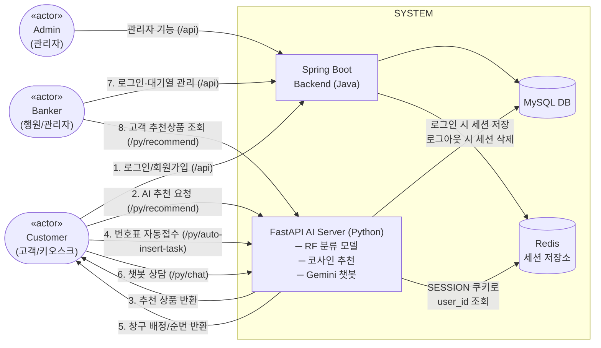

# BankScope
## - Conceptualization document -

**Student No:** 21622137  
**Name:** 최재영  
**E-mail:** silversky621@naver.com

---

## [ Revision history ]

| Revision date | Version # | Description | Author |
|:---:|:---:|:---:|:---:|
| 26/03/15 | 1.0.0 | First Draft 작성 | 최재영 |
| 26/03/21 | 1.0.1 | Use Case 및 Concept of operation 수정 | 최재영 |
| 26/05/20 | 2.0.0 | 실제 구현 및 프로토타이핑 결과를 바탕으로 한 기능 재정의 (RF 22분류, Gemini 챗봇, Admin/Toss 기능 추가 반영) | 최재영 |
| 26/05/30 | 2.1.0 | Business purpose 섹션에 추진 배경·문제 정의·프로젝트 목적·포용적 옴니채널 뱅킹 정의 추가 | 최재영 |
| 26/05/30 | 2.2.0 | System context diagram을 Mermaid flowchart로 전환 | 최재영 |
| 26/05/30 | 2.3.0 | Concept of operation #2 추천 로직 반영 (AI 서버 직접 피처 조회, 나이 필터링, product_id 직접 사용) | 최재영 |
| 26/05/30 | 2.4.0 | 전체 문서 정합성 수정 (BCrypt/AES 구분, AI 서버 직접 호출 반영, 22개 피처 명세) | 최재영 |
| 26/06/02 | 2.5.0 | Redis 세션 저장소 도입 반영 (System context diagram, CoO #5 챗봇 인증 흐름, Glossary) | 최재영 |
| 26/06/03 | 2.6.0 | 채널별 세션 타입(loginType) 분리 설계 반영 (CoO #1 로그인 접근 제어 추가) | 최재영 |

---

## = Contents =

1. Business purpose
2. System context diagram
3. Use case list
4. Concept of operation
5. Problem statement
6. Glossary
7. References

---

## 1. Business purpose

### 1.1 추진 배경

한국 금융 산업은 코로나19 팬데믹 이후 비대면 채널 중심의 디지털 전환(Digital Transformation)이 급격히 가속화되어 왔다. 그 결과 시중 은행의 영업점은 지난 5년간 지속적으로 축소되었으며, 모바일 앱 중심의 금융 서비스가 표준으로 자리잡았다. 그러나 이러한 변화는 디지털 기기 사용에 익숙하지 않은 노령층, 장애인, 외국인, 사회초년생 등 디지털 취약계층을 금융 서비스로부터 구조적으로 배제하는 '디지털 디바이드(Digital Divide)' 문제를 심화시키고 있다. 특히 키오스크 조작의 복잡성, 낯선 금융 용어, 공동인증서·OTP 등 다단계 인증 장벽은 오프라인 영업점에서조차 취약계층의 금융 접근성을 저해하는 주요 요인이다.

### 1.2 문제 정의

본 프로젝트는 다음 세 가지 문제에 주목한다. 첫째, 기존 영업점 키오스크는 일반 사용자 기준으로 설계되어 취약계층의 조작 오류 및 업무 포기율이 높다. 둘째, 행원이 고객을 응대하는 시점에 비로소 고객의 니즈를 파악하기 시작하므로 평균 대기 시간 및 업무 처리 시간이 길어진다. 셋째, 고객 맞춤형 상품 추천 및 자동 응대에 AI를 적용할 때 발생하는 신뢰성 문제이다. 추천 알고리즘의 판단 근거를 고객과 행원이 알 수 없는 '블랙박스' 현상이 발생하거나, 생성형 AI 챗봇이 부정확한 금융 상품 정보를 안내하는 환각(Hallucination) 리스크가 존재한다. 따라서 서비스 상용화를 위해서는 설명 가능한 AI(XAI)와 엄격한 프롬프트 가드레일이 필수적이다.

### 1.3 프로젝트 목적

뱅크스코프(BankScope)는 위 세 가지 문제를 단일 플랫폼에서 해결하는 'AI 기반 옴니채널 금융 플랫폼'이다. 본 시스템은 ① Two-Track 지능형 키오스크를 통한 취약계층 접근성 보장, ② 행원 워크스페이스·Mini-ERP와의 실시간 연동을 통한 사전 인지 기반 응대, ③ SHAP·환각 통제 가드레일이 적용된 신뢰 가능한 AI 서비스를 핵심 차별 요소로 한다. 궁극적인 목적은 디지털 취약계층이 오프라인 창구에서 안전한 디지털 금융 채널로 자연스럽게 이동할 수 있도록 돕는 '포용 금융(Inclusive Finance) 브릿지'를 구현하는 데 있다.

### 1.4 포용적 옴니채널 뱅킹의 정의

본 문서에서 정의하는 '포용적 옴니채널 뱅킹(Inclusive Omni-channel Banking)'은 단순히 다채널(Multi-channel)을 제공하는 것을 넘어, 모든 채널이 동일한 사용자 컨텍스트와 거래 무결성을 공유하면서 동시에 디지털 취약계층을 일등 사용자(First-class User)로 가정하는 설계 철학을 의미한다. 즉, 키오스크에서 비회원으로 시작한 고객의 컨텍스트가 행원 워크스페이스로 실시간 이관되고, 행원이 응대한 결과가 다시 고객용 디지털 웹에서의 맞춤형 상품 추천으로 이어지는 폐쇄 루프(Closed-loop) 옴니채널을 구현한다.

---

### Goal

**첫째, 맞춤형 상품 추천:** 고객의 나이, 법인 여부, 총 잔액, 대출 보유 여부, 최근 거래 빈도 등의 데이터를 기반으로 Cosine Similarity 알고리즘을 통해 유사 고객군이 가입한 금융 상품 Top 3를 우선 추천한다.

**둘째, AI 지능형 창구 라우팅:** 영업점 키오스크에서 접수 시 22개 피처(나이, 대출 현황, 카드 보유 여부, 최근 거래 패턴 등)를 Random Forest 모델이 분석하여 22가지 세부 업무 유형 중 하나로 분류, 업무 복잡도에 따라 A(빠른 업무) / B(상담 업무) / C(기업·특수) 창구에 번호표를 자동 발급한다.

**셋째, AI 금융 챗봇:** Google Gemini 2.5 Flash 모델을 기반으로, 사이트 이용 가이드와 현재 DB의 금융 상품 정보를 컨텍스트로 제공하여 고객 질문에 실시간 답변하는 AI 상담원을 제공한다.

**넷째, 통합 관리 환경 구축:** Spring Boot 백엔드와 Python AI 서버(FastAPI)가 협력하는 3-tier 아키텍처를 통해 데이터 정합성을 확보하고, 관리자가 금융 상품, 금리, 회원, 게시판을 한 곳에서 관리할 수 있는 통합 환경을 구축한다.

### Target Market

금융 업무를 보는 **'은행 고객'**, 영업점 현장에서 고객 대기열을 관리하는 **'은행 행원(Member)'**, 그리고 시스템 전반을 운영·관리하는 **'관리자(Admin)'** 가 주 대상자이다.

---

## 2. System context diagram

이 프로젝트를 위해 작성한 System Context Diagram의 구조는 아래와 같다.

프론트엔드는 경로 prefix에 따라 요청을 분기한다. `/api/*`는 Spring Boot 백엔드로, `/py/*`는 FastAPI AI 서버로 직접 라우팅된다(Vite proxy/Nginx). Spring Boot와 AI 서버는 각각 독립적으로 MySQL DB에 접근하며, 두 서버 간 직접 통신은 없다. 단, Redis를 공유 세션 저장소로 활용한다. Spring Boot는 로그인 시 `bankscope:chat:{sessionId}` → `userId` 키를 Redis에 저장하고, FastAPI AI 서버는 `/py/chat` 요청의 SESSION 쿠키를 Redis에서 조회하여 user_id를 추출함으로써 챗봇 서비스의 인증을 수행한다.

---

## 3. Use case list

이 프로젝트에서 발견할 수 있는 use cases는 다음과 같다.

### 1) Register & Login (회원가입 및 로그인)

| | |
|---|---|
| **Actor** | Customer, Banker, Admin |
| **Description** | 고객(user_type=0), 행원(member), 관리자(user_type=admin)로 구분하여 회원을 등록하고 인증한다. 로그인 성공 시 권한에 따라 고객 메인화면, 행원 워크스페이스, 관리자 대시보드로 각각 라우팅된다. |

### 2) Recommend Financial Products (AI 금융 상품 추천)

| | |
|---|---|
| **Actor** | Customer |
| **Description** | 고객이 로그인하면 Python AI 서버가 해당 고객의 프로필(나이, 총 잔액, 대출 여부 등)을 Cosine Similarity로 분석하여 가장 적합한 금융 상품 Top 3를 메인 화면에 추천한다. 추천 모델은 CSV 가상 데이터와 실제 DB 구독 데이터를 병합하여 학습한다. |

### 3) Inquire Product Details (금융 상품 상세 조회)

| | |
|---|---|
| **Actor** | Customer |
| **Description** | 추천된 상품 또는 전체 상품 목록에서 특정 상품을 선택하면 기본 금리, 최고 금리, 가입 기간, 가입 대상, 상품 설명 등의 상세 정보를 조회한다. |

### 4) Reserve Smart Ticket (AI 지능형 창구 접수)

| | |
|---|---|
| **Actor** | Customer (키오스크) |
| **Description** | 고객이 키오스크에서 접수 버튼을 누르면 AI(Random Forest)가 22개 피처를 분석하여 방문 목적(22가지 세부 업무 중 하나)을 예측한다. 예측 결과에 따라 A(빠른 업무)/B(상담 업무)/C(기업·특수) 계열 번호표를 자동 발급하고, 처리 가능한 최소 직급 이상의 가장 한가한 행원에게 자동 배정한다. |

### 5) Manage Queue (대기열 관리 및 고객 호출)

| | |
|---|---|
| **Actor** | Banker |
| **Description** | 행원은 자신에게 배정된 대기 고객 목록과 AI가 예측한 방문 목적을 사전에 확인한다. '호출' 버튼으로 고객을 부르고, 처리 완료 후 '완료'로 상태를 갱신한다. 자신이 처리할 수 없는 업무는 다른 행원 창구로 토스(이관)할 수 있다. |

### 6) AI Chatbot Consultation (AI 챗봇 금융 상담)

| | |
|---|---|
| **Actor** | Customer |
| **Description** | 로그인한 회원이 챗봇 화면에서 질문을 입력하면 Gemini 2.5 Flash 모델이 사이트 이용 가이드와 현재 DB의 금융 상품 정보를 컨텍스트로 참조하여 답변한다. 로그인 회원당 1일 30건의 이용 한도가 적용된다. |

### 7) Manage System (관리자 시스템 관리)

| | |
|---|---|
| **Actor** | Admin |
| **Description** | 관리자는 금융 상품 등록/수정/삭제, 금리 관리, 회원 조회/관리, 게시판 관리, 창구 대기열 강제 이관 등 시스템 전반을 관리한다. 관리자 대시보드에서는 실시간 대기 현황과 창구 운영 상태를 모니터링할 수 있다. |

---

## 4. Concept of operation

이 장은 use cases를 어떻게 작동할지에 대한 구체적인 작동 개념을 기술한 장이다.

### 1) Register & Login

| | |
|---|---|
| **Purpose** | 고객·행원·관리자의 역할을 명확히 식별하여 각 권한에 맞는 기능만 노출하고, AI가 고객 데이터를 올바르게 조회할 수 있도록 고유 ID가 필요하다. |
| **Approach** | 회원가입 시 비밀번호는 BCrypt 단방향 해싱하여 DB에 저장하고, 주민등록번호는 AES 양방향 암호화하여 저장한다. 로그인 성공 시 서버 세션에 사용자 정보와 함께 접속 채널 구분자(`loginType`)를 저장한다. 웹 로그인(이메일+비밀번호)은 `loginType=web`, 키오스크 로그인(주민등록번호)은 `loginType=kiosk`로 구분된다. 권한(user_type)에 따라 고객 메인화면, 행원 워크스페이스, 관리자 대시보드로 라우팅하며, 비밀번호 변경·대출 신청·카드 발급 등 민감한 작업은 `loginType=web` 세션에서만 허용된다. |
| **Dynamics** | 서비스를 처음 이용하거나 기존 계정으로 로그인하는 경우. |
| **Goals** | BCrypt 해싱 기반의 안전한 비밀번호 인증, 역할(Role)별 기능 접근 제어, 채널(web/kiosk)별 세션 타입 분리를 통한 키오스크 로그인의 권한 범위 제한. |

### 2) Recommend Financial Products

| | |
|---|---|
| **Purpose** | 수십 가지 금융 상품 중 고객이 직접 탐색하는 수고를 줄이고, 플랫폼 방문 즉시 관련성 높은 상품을 제시하여 만족도를 높인다. |
| **Approach** | 고객 로그인 후 메인 화면 진입 시 프론트엔드가 AI 서버(`GET /py/recommend/{user_id}`)를 직접 호출한다. AI 서버는 DB에서 직접 해당 고객의 5개 피처(나이, 법인 여부, 총 잔액, 대출 보유 여부, 최근 1개월 거래 횟수)를 조회하고, MinMaxScaler 정규화 후 Cosine Similarity로 학습 데이터 내 유사 고객 프로파일 상위 20건을 추출하여 가장 많이 가입한 상품 Top 3의 product_id를 선정한다. 이후 고객의 나이에 대한 가입 연령 조건(min_age/max_age)을 필터링하여 조건에 맞는 상품의 상세 정보를 포함한 최종 목록을 프론트엔드에 직접 반환한다. 추천 모델의 학습 데이터는 product_id가 직접 포함된 CSV 가상 데이터와 실제 DB `product_subscription` 데이터를 서버 시작 시 자동 병합하여 구성하며, CSV에 product_id를 직접 저장하므로 상품명 변경 시에도 데이터 무결성이 유지된다. |
| **Dynamics** | 고객이 로그인 직후 메인 화면에 진입하는 경우. |
| **Goals** | 맞춤형 큐레이션을 통해 고객의 상품 탐색 시간 단축 및 개인화 경험 제공. |

### 3) Reserve Smart Ticket (AI 지능형 창구 접수)

| | |
|---|---|
| **Purpose** | 번호표 선택 오류를 제거하고, 업무 복잡도와 행원 직급·여유 시간을 함께 고려한 최적 창구 자동 배정으로 대기 시간을 단축한다. |
| **Approach** | 고객이 키오스크에서 자동접수 버튼을 누르면 키오스크 프론트엔드가 AI 서버(`POST /py/auto-insert-task`)를 직접 호출한다. AI 서버는 DB에서 22개 피처(`age`, `is_corporate`, `gender`, `total_balance`, `account_count`, `has_active_loan`, `has_overdue_loan`, `has_upcoming_payment`, `has_issuing_card`, `has_check_card`, `has_credit_card`, `has_deposit_sub`, `has_savings_sub`, `default_risk_level`, `recent_deposit_count`, `recent_withdrawal_count`, `recent_transfer_count`, `days_since_last_tx`, `max_password_fail_count`, `has_business_id`, `savings_near_maturity`, `deposit_near_maturity`)를 추출하여 학습된 Random Forest 모델(300트리, 22분류)로 세부 업무 유형을 예측한다. 예측된 업무 유형에 따라 A(빠른 업무, 5분)/B(상담 업무, 10분)/C(기업·특수, 25분) 계열 티켓 번호를 생성하고, 해당 업무를 처리할 수 있는 최소 직급 이상의 행원 중 현재 대기 누적 시간이 가장 짧은 행원에게 FOR UPDATE 행 잠금으로 동시 중복 배정 없이 발급한다. |
| **Dynamics** | 오프라인 지점을 방문하여 키오스크에서 번호표를 뽑고자 하는 경우. |
| **Goals** | AI 기반 22분류 업무 예측을 통한 창구 트래픽 자동 분산 및 행원 직급별 최적 배정. |

### 4) Manage Queue

| | |
|---|---|
| **Purpose** | 행원이 AI가 이미 분석해둔 고객의 방문 목적을 미리 파악하고 대기 순서를 체계적으로 관리하기 위함이다. |
| **Approach** | 행원 로그인 시 자신의 member_id로 배정된 WAITING 상태 task를 리스트로 불러온다. AI가 예측한 `task_detail_type`(세부 업무명)이 함께 표시되어 행원이 미리 준비할 수 있다. '호출' 시 상태가 IN_PROGRESS로, '완료' 시 COMPLETED로 변경된다. 자신의 직급으로 처리 불가한 업무는 다른 행원 창구로 토스(이관)할 수 있으며, 관리자는 강제 이관도 가능하다. WebSocket을 통해 행원-고객 간 실시간 채팅도 지원한다. |
| **Dynamics** | 앞 고객의 업무 처리가 끝나 다음 고객을 응대해야 하는 경우, 또는 업무 이관이 필요한 경우. |
| **Goals** | 혼선 없는 대기열 관리, AI 예측 업무 유형의 사전 인지, 직급별 업무 분배 자동화. |

### 5) AI Chatbot Consultation

| | |
|---|---|
| **Purpose** | 간단한 금융 상품 문의나 사이트 이용 안내를 24시간 자동으로 처리하여 행원 업무 부담을 줄이고 고객 대기 없이 즉시 답변을 제공한다. |
| **Approach** | 챗봇은 로그인한 회원 전용 서비스이다. 고객이 질문을 입력하면 프론트엔드가 AI 서버(`POST /py/chat`)를 직접 호출하며, 이 때 브라우저가 SESSION 쿠키를 자동으로 첨부한다. AI 서버는 SESSION 쿠키를 Redis에서 조회하여 user_id를 추출하고, 인증에 실패하면 즉시 거부한다. 인증 성공 시 사이트 이용 가이드 텍스트와 현재 DB에서 조회한 활성 금융 상품 목록을 컨텍스트로 구성하여 Google Gemini 2.5 Flash API에 프롬프트를 전송한다. 참조 데이터에 없는 내용은 직접 방문 또는 고객센터 문의를 안내하도록 프롬프트가 설계되어 있다. 인증된 사용자당 1일 30건 한도로 제한된다. |
| **Dynamics** | 로그인한 고객이 금융 상품, 금리, 이용 방법 등을 웹에서 즉시 문의하는 경우. |
| **Goals** | LLM 기반 실시간 금융 상담으로 고객 편의 향상 및 단순 문의 자동화. Redis 세션 인증으로 미인증 API 호출 차단. |

---

## 5. Problem statement

이 장에서는 소프트웨어를 설계하고 구현하는 과정에서 고려해야 할 기술적 관점과 다양한 문제점(Rootcause)을 기술한다.

### AI 모델 연동 및 응답 속도

이 시스템의 핵심은 AI 기능이다. Random Forest 모델은 Python 환경(Scikit-learn)에서 학습되고 joblib으로 직렬화(`.pkl`)하여 저장한다. 이를 Java 백엔드와 연동하기 위해 FastAPI로 REST API를 구성하였다. AI 추론 자체는 빠르나 DB에서 22개 피처를 수십 개의 서브쿼리로 추출하는 과정에서 병목이 발생할 수 있다. (해결책: 커넥션 풀(pool_size=5) 적용 및 중복 접수 방지 쿼리를 피처 추출 쿼리보다 먼저 실행하여 불필요한 DB 조회를 선제적으로 차단)

### 동시 접수 충돌 방지

여러 고객이 동시에 키오스크에서 접수를 요청할 경우 동일한 티켓 번호가 중복 발급될 수 있다. (해결책: 티켓 번호 조회 쿼리에 `FOR UPDATE` 행 잠금을 적용하여 번호 생성 트랜잭션을 직렬화, 중복 발급을 원천 차단)

### 가상 데이터의 한계 및 실데이터 병합

실제 은행의 고객 데이터는 개인정보보호법에 의해 접근이 불가능하다. 따라서 AI 모델 학습을 위해 파이썬 스크립트로 구축한 CSV 형태의 가상 마스터 데이터를 기반으로 삼되, 시스템 실제 운영 중 누적된 COMPLETED 상태의 task 데이터를 자동으로 병합하여 모델을 재학습할 수 있는 구조를 갖추었다. 이를 통해 운영 데이터가 쌓일수록 예측 정확도가 향상되는 자기 개선(self-improving) 파이프라인을 구현하였다.

### RF 다중 분류 정확도 (22분류)

초기 설계의 3분류(대출·예금·기타) 방식에서 22가지 세부 업무 유형 직접 예측으로 전면 개편하면서 분류 난이도가 크게 높아졌다. 클래스 불균형 문제는 `class_weight='balanced'` 옵션으로 처리하였으며, 목표 정확도 80%에 미달할 경우 모델을 저장하지 않아 품질 기준 미달 모델의 서비스 투입을 방지한다. 5-Fold 교차 검증으로 과적합 여부를 함께 모니터링한다.

### AI 예측 근거의 불투명성 (Explainability)

AI가 특정 창구로 배정한 이유를 사용자나 관리자가 이해할 수 없으면 시스템 신뢰도가 낮아진다. (해결책: SHAP(SHapley Additive exPlanations) TreeExplainer를 적용하여 `GET /py/explain/{user_id}` 엔드포인트에서 특정 고객의 예측 근거를 Waterfall 차트 이미지로 반환, 피처별 기여도를 시각화)

---

## 6. Glossary

| Terms | Description |
|---|---|
| Cosine Similarity (코사인 유사도) | 두 데이터 벡터 간의 코사인 각도를 이용하여 서로 얼마나 유사한지 측정하는 알고리즘으로, 맞춤형 금융 상품 추천에 사용된다. |
| Random Forest (랜덤포레스트) | 다수의 의사결정 나무(Decision Tree)를 앙상블하여 예측 정확도를 높이는 다중 분류 AI 모델로, 본 시스템에서는 22가지 세부 업무 유형 예측 및 창구 라우팅에 사용된다. |
| SHAP (SHapley Additive exPlanations) | AI 모델의 예측 결과에 대해 각 입력 피처가 얼마나 기여했는지를 수치로 설명하는 XAI(설명 가능한 AI) 기법. 본 시스템에서 창구 배정 근거의 시각적 설명에 활용된다. |
| Gemini 2.5 Flash | Google DeepMind의 경량 LLM 모델. 본 시스템에서는 사이트 가이드와 금융 상품 정보를 컨텍스트로 제공하는 RAG 방식으로 챗봇 서비스에 활용된다. |
| BankScope | 본 프로젝트에서 개발하는 '통합 지능형 창구 라우팅 및 추천 시스템'의 공식 명칭. |
| 대기열 (Queue) | 번호표를 발급받은 고객들이 순서대로 상담을 기다리는 task 레코드의 집합. WAITING → IN_PROGRESS → COMPLETED 순으로 상태가 변경된다. |
| 라우팅 (Routing) | AI 분석 결과에 따라 고객을 A(빠른 업무) / B(상담 업무) / C(기업·특수) 계열 창구 중 가장 적합한 행원에게 자동 배정하는 과정. |
| 티켓 번호 (Ticket Number) | 창구 계열 접두사(A/B/C)와 순번(001~)으로 구성된 고객 번호표 식별자. 예: A-001, B-042, C-003. |
| Mock Data (가상 데이터) | 실제 금융 데이터 접근이 불가능하므로, AI 모델 학습과 DB 구성을 위해 임의로 생성한 가상의 훈련용 고객 거래 데이터. 서비스 운영 중 실데이터와 자동 병합된다. |
| Redis | 인메모리 Key-Value 저장소. 본 시스템에서는 Spring Boot와 FastAPI AI 서버 간의 공유 세션 저장소로 활용된다. 로그인 시 세션 ID와 user_id의 매핑 정보를 저장하고, AI 서버는 이를 조회하여 챗봇 요청의 인증을 수행한다. |
| SESSION 쿠키 | Spring Session이 발급하는 세션 식별자 쿠키. Base64url 인코딩된 세션 ID를 담으며, 브라우저가 동일 도메인 요청에 자동 첨부한다. AI 서버는 이 쿠키로 Redis를 조회하여 user_id를 추출한다. |
| 토스 (Toss) | 행원이 자신의 직급으로 처리 불가한 업무를 다른 행원 창구로 이관하는 기능. 관리자는 강제 이관도 가능하다. |
| Level (행원 직급) | 행원의 업무 처리 권한 등급. LEVEL_1(입금·출금 등 단순업무)~LEVEL_5(부도관리 등 고난도 업무)로 구성되며, AI가 예측한 업무 유형에 따라 처리 가능한 최소 직급이 결정된다. |

---

## 7. References

KB국민은행 웹페이지  
https://www.kbstar.com/

농협은행 웹페이지  
https://banking.nonghyup.com/nhbank.html

금융 상담 데이터에 대한 인공지능 학습을 통한 금융 상품 추천 시스템  
출원번호/일자: 1020220077345 (2022.06.24)

Scikit-learn RandomForestClassifier Documentation  
https://scikit-learn.org/stable/modules/generated/sklearn.ensemble.RandomForestClassifier.html

SHAP (SHapley Additive exPlanations) Documentation  
https://shap.readthedocs.io/

Google Gemini API Documentation  
https://ai.google.dev/gemini-api/docs