# BankScope
## - Design document -

| Student No. | 21622137 |
|:---:|:---|
| Name | 최재영 |
| E-mail | silversky621@naver.com |

---

## [ Revision history ]

| Revision date | Version # | Description | Author |
|:---|:---|:---|:---|
| 2026.05.21 | 1.0.0 | First Draft | 최재영 |
| 2026.05.30 | 1.1.0 | Introduction에 추진 배경·문제 정의·프로젝트 목적 반영 및 Important Points of Design에 XAI·가드레일 설계 원칙 추가 (Conceptualization v2.1.0 기준 동기화) | 최재영 |
| 2026.05.30 | 1.2.0 | Sequence Diagram #3 및 AIRecommender 클래스 추천 로직 반영 (AI 서버 직접 피처 조회, 나이 필터링, product_id 직접 사용) | 최재영 |
| 2026.05.30 | 1.3.0 | 전체 문서 정합성 수정 (BCrypt/AES 구분, 로그인 방식별 다이어그램, 직접접수 시퀀스 추가, Task 클래스 속성 보완) | 최재영 |
| 2026.06.02 | 1.4.0 | Redis 세션 저장소 도입 반영 (챗봇 시퀀스 인증 흐름, Chatbot 클래스, Important Points, S/W requirements, Glossary) | 최재영 |
| 2026.06.03 | 1.5.0 | 채널별 세션 타입(loginType) 분리 설계 반영 (Important Points, 로그인 시퀀스 다이어그램) | 최재영 |
|  |  |  |  |

---

## = Contents =

1. Introduction ·········································································· 4
2. Class Diagram ········································································· 5
3. Sequence Diagram ······································································ 9
4. State machine Diagram ································································· 17
5. Implementation Requirements ··························································· 18
6. Glossary ·············································································· 18
7. References ············································································ 19

---

## 1. Introduction

### 1) Summary

코로나19 이후 금융 산업의 디지털 전환이 가속화되면서 디지털 취약계층(노령층·장애인·외국인 등)이 금융 서비스에서 구조적으로 배제되는 '디지털 디바이드(Digital Divide)' 문제가 심화되었다. 오프라인 영업점에서도 기존 번호표 시스템은 고객이 방문 목적에 맞는 업무 유형을 직접 판단해야 하므로 잘못된 창구 배정 오류가 빈번하다. 온라인 채널에서는 방대한 금융 상품 정보 속에서 개인에게 맞는 상품을 찾기 어렵고, AI 추천 알고리즘의 블랙박스 문제와 생성형 AI의 환각(Hallucination) 리스크가 서비스 신뢰성을 저해하는 추가적인 과제로 부상하였다.

본 프로젝트 'BankScope'는 이러한 세 가지 문제를 단일 통합 웹 플랫폼으로 해결한다. Random Forest AI가 22개 고객 피처를 분석하여 22가지 세부 업무 유형 중 하나로 분류하고 A(빠른 업무, 5분) / B(상담 업무, 10분) / C(기업·특수, 25분) 창구에 번호표를 자동 배정한다. Cosine Similarity 기반 추천 엔진은 로그인과 동시에 고객 프로필에 맞는 금융 상품 Top 3를 제안하며, Google Gemini 2.5 Flash 모델 기반 AI 챗봇이 실시간 금융 상담을 제공한다. SHAP TreeExplainer를 통한 XAI와 엄격한 프롬프트 가드레일을 적용하여 AI 신뢰성을 확보하고, 고객·행원·관리자·비회원의 역할이 엄격히 분리된 3-tier 아키텍처(React 프론트엔드, Spring Boot 백엔드, Python FastAPI AI 서버)로 구현된다.

이 문서는 BankScope 개발을 위한 세 번째 단계인 Design에 대한 내용으로, 시스템의 주요 클래스 구조와 객체 간 상호작용(Sequence Diagram), 상태 전이(State Machine Diagram)를 통해 실제 구현에 대한 세부적인 사항을 명시한다.

### 2) Important Points of Design

- 사용자 권한(Customer, Member, Admin, Non-member)에 따라 접근 가능한 기능이 엄격히 분리되어야 한다.
- 로그인 채널(웹/키오스크)에 따라 세션 타입(`loginType: web | kiosk`)을 구분하여 저장하고, 비밀번호 변경·대출 신청·카드 발급 등 민감한 작업은 `web` 타입 세션에서만 허용한다. 이를 통해 주민등록번호만으로 인증된 키오스크 세션이 웹 전용 기능에 접근하는 것을 방지한다.
- Spring Boot 백엔드와 Python FastAPI AI 서버 간의 직접 통신은 없으며, AI 추론 로직과 비즈니스 로직이 서버별로 명확히 분리되어야 한다. 단, 챗봇 인증을 위해 Redis를 공유 세션 저장소로 활용한다. Spring Boot는 로그인 시 Redis에 세션 정보를 저장하고, AI 서버는 SESSION 쿠키를 Redis에서 조회하여 user_id를 추출한다.
- 번호표 발급 시 동시 다중 요청으로 인한 중복 번호 발급을 방지하기 위해 DB 레벨의 SELECT FOR UPDATE 잠금을 반드시 적용한다.
- AI 창구 배정 근거의 투명성 확보를 위해 SHAP TreeExplainer 기반 XAI를 설계에 반드시 포함하며, 챗봇의 환각(Hallucination) 방지를 위해 RAG 방식과 프롬프트 가드레일을 적용한다.
- 디지털 취약계층을 일등 사용자(First-class User)로 가정하는 설계 철학에 따라, 키오스크 UI는 최소한의 조작 단계로 번호표 발급이 완료되어야 한다.

---

## 2. Class Diagram

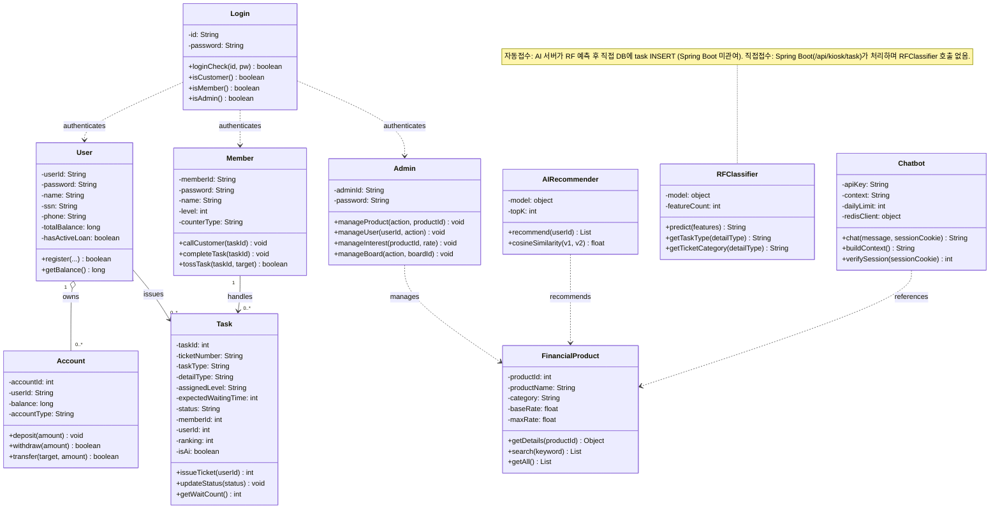

> **관계 표기 설명**
> - `Login ..> User / Member / Admin` : 로그인 시 세 주체의 권한을 판별하는 **의존(dependency)** 관계
> - `User "1" o-- "0..*" Account` : `user_id`가 `account` 테이블의 FK인 **집합(aggregation)** 관계
> - `User "1" --> "0..*" Task` / `Member "1" --> "0..*" Task` : 고객이 번호표를 발급하고 행원이 처리하는 **연관(association)** 관계
> - `AIRecommender / Chatbot ..> FinancialProduct` : AI 서버(FastAPI)가 상품 데이터를 조회하는 **의존** 관계

### 1) User

#### (1) Attributes
- `-userId: String` : 고객 아이디
- `-password: String` : BCrypt 해시된 비밀번호
- `-name: String` : 고객 이름
- `-ssn: String` : 주민등록번호 (나이·성별 추출에 활용)
- `-phone: String` : 전화번호
- `-totalBalance: long` : 전체 계좌 합산 잔액
- `-hasActiveLoan: boolean` : 활성 대출 보유 여부

#### (2) Methods
- `+register(userId:String, password:String, name:String, ssn:String, phone:String):boolean` : 고객 회원가입. 아이디 중복 시 false 반환
- `+getBalance():long` : 전체 계좌 합산 잔액 반환

### 2) Member

#### (1) Attributes
- `-memberId: String` : 행원 아이디
- `-password: String` : 비밀번호
- `-name: String` : 행원 이름
- `-level: int` : 행원 레벨 (1~5). 레벨에 따라 처리 가능한 업무 범위가 결정됨
- `-counterType: String` : 담당 창구 유형 (A / B / C)

#### (2) Methods
- `+callCustomer(taskId:int):void` : 대기 중인 고객을 호출. task 상태를 '호출'로 변경
- `+completeTask(taskId:int):void` : 업무 완료 처리. task 상태를 '완료'로 변경
- `+tossTask(taskId:int, targetMemberId:String):boolean` : 담당 업무를 다른 행원에게 이관. 성공 시 true 반환

### 3) Login

#### (1) Attributes
- `-id: String` : 로그인에 사용하는 아이디
- `-password: String` : 로그인에 사용하는 비밀번호

#### (2) Methods
- `+loginCheck(id:String, pw:String):boolean` : 아이디와 비밀번호 일치 여부 확인
- `+isCustomer():boolean` : 로그인 아이디가 고객(userType=0)인지 판별
- `+isMember():boolean` : 로그인 아이디가 행원인지 판별
- `+isAdmin():boolean` : 로그인 아이디가 관리자인지 판별

### 4) Admin

#### (1) Attributes
- `-adminId: String` : 관리자 아이디
- `-password: String` : 비밀번호

#### (2) Methods
- `+manageProduct(action:String, productId:int):void` : 금융 상품 추가·수정·삭제 (가입 연령 조건 min_age/max_age 포함). 설정된 연령 조건은 AI 추천 필터링에 활용됨
- `+manageUser(userId:String, action:String):void` : 고객 정보 조회 및 상태 변경
- `+manageInterest(productId:int, rate:float):void` : 금융 상품 금리 수정
- `+manageBoard(action:String, boardId:int):void` : 게시글 삭제·관리

### 5) Task

#### (1) Attributes
- `-taskId: int` : 업무 고유 식별 번호
- `-ticketNumber: String` : 창구 계열 접두사 + 순번 (예: A-047). FOR UPDATE 잠금으로 중복 발급 방지
- `-taskType: String` : 창구 유형 (빠른 업무 A / 상담 업무 B / 기업·특수 C)
- `-detailType: String` : 22가지 세부 업무 유형 (입금, 출금, 적금, 대출 등)
- `-assignedLevel: String` : 처리 가능한 최소 행원 직급
- `-expectedWaitingTime: int` : 예상 대기 시간 (분)
- `-status: String` : 현재 상태 (WAITING / IN_PROGRESS / COMPLETED)
- `-memberId: int` : 배정된 행원 ID
- `-userId: int` : 번호표를 발급받은 고객 ID (비회원은 null)
- `-ranking: int` : 해당 행원 창구 내 대기 순서
- `-isAi: boolean` : AI 자동접수 여부 (true = AI 자동, false = 직접 접수)

#### (2) Methods
- `+issueTicket(userId:String):int` : 번호표 발급. DB SELECT FOR UPDATE로 잠금 후 번호 채번하여 반환
- `+updateStatus(status:String):void` : task 상태 업데이트
- `+getWaitCount():int` : 해당 창구의 현재 대기 인원 수 반환

### 6) FinancialProduct

#### (1) Attributes
- `-productId: int` : 상품 고유 번호
- `-productName: String` : 상품명
- `-category: String` : 카테고리 (예금 / 적금 / 대출 / 펀드 등)
- `-baseRate: float` : 기본 금리
- `-maxRate: float` : 최고 금리

#### (2) Methods
- `+getDetails(productId:int):Object` : 상품 상세 정보(금리, 가입 기간, 우대 조건 등) 반환
- `+search(keyword:String):List` : 키워드로 상품 검색
- `+getAll():List` : 전체 활성 상품 목록 반환

### 7) Account

#### (1) Attributes
- `-accountId: int` : 계좌 고유 번호
- `-userId: String` : 계좌 소유 고객 아이디
- `-balance: long` : 현재 잔액
- `-accountType: String` : 계좌 유형 (입출금 / 정기예금 / 적금 등)

#### (2) Methods
- `+deposit(amount:long):void` : 입금 처리 및 거래 내역 저장
- `+withdraw(amount:long):boolean` : 출금 처리. 잔액 부족 시 false 반환
- `+transfer(targetAccountId:int, amount:long):boolean` : 이체 처리. 성공 시 true 반환

### 8) AIRecommender

#### (1) Attributes
- `-model: object` : Cosine Similarity 기반 추천 모델 (MinMaxScaler 포함)
- `-topK: int` : 유사도 계산 시 참조할 상위 유사 고객 수 (기본값 20)

#### (2) Methods
- `+recommend(userId:int):List` : user_id를 받아 DB에서 직접 5개 피처를 조회하고, 유사 고객 Top 20 기반 Top 3 product_id 선정 후 나이 조건(min_age/max_age) 필터링을 거쳐 상품 상세 정보 목록 반환
- `+cosineSimilarity(v1:List, v2:List):float` : 두 벡터 간 코사인 유사도 계산

### 9) RFClassifier

#### (1) Attributes
- `-model: object` : 학습된 Random Forest 분류 모델 (.pkl 파일에서 로드)
- `-featureCount: int` : 입력 피처 수 (22개)

#### (2) Methods
- `+predict(features:List):String` : 22개 피처 벡터를 입력받아 22가지 세부 업무 유형 중 하나를 예측하여 반환
- `+getTaskType(detailType:String):String` : 세부 업무 유형을 창구 유형(A / B / C)으로 변환하여 반환
- `+getTicketCategory(detailType:String):String` : 세부 업무 유형에 해당하는 처리 예상 시간과 창구 prefix 반환

### 10) Chatbot

#### (1) Attributes
- `-apiKey: String` : Google Gemini API 키
- `-context: String` : RAG 컨텍스트 (사이트 이용 가이드 + DB 금융 상품 목록)
- `-dailyLimit: int` : 일일 사용 한도 (30회)
- `-redisClient: object` : Redis 연결 클라이언트 (세션 인증용)

#### (2) Methods
- `+chat(message:String, sessionCookie:String):String` : SESSION 쿠키로 Redis 인증 후 Gemini 모델에 메시지를 전달하고 응답 반환. 미인증 시 거부
- `+buildContext():String` : site_guide.txt와 현재 DB 금융 상품 정보를 결합하여 프롬프트 컨텍스트 구성
- `+verifySession(sessionCookie:String):int` : SESSION 쿠키를 Base64url 디코딩하여 Redis에서 user_id 조회. 유효하지 않으면 -1 반환

---

## 3. Sequence Diagram

### 1) 회원가입

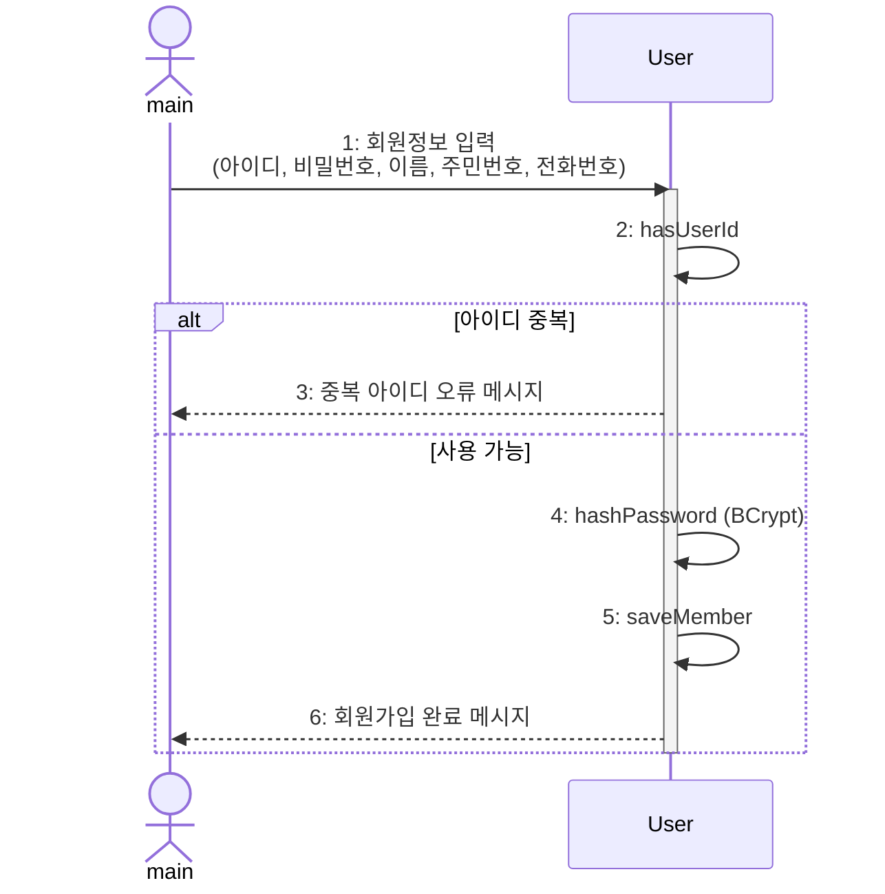

위의 그림은 시스템 실행 후 회원가입 기능을 수행할 때를 표현한 Sequence Diagram이다. main에서 아이디, 비밀번호, 이름, 주민등록번호, 전화번호를 입력하면 아이디 중복 여부를 확인한다. 중복이 있다면 오류 메시지를 출력하고, 없다면 비밀번호를 BCrypt로 해싱하고 주민번호는 AES로 암호화하여 DB에 저장 후 회원가입 완료 메시지를 출력한다.

### 2) 로그인

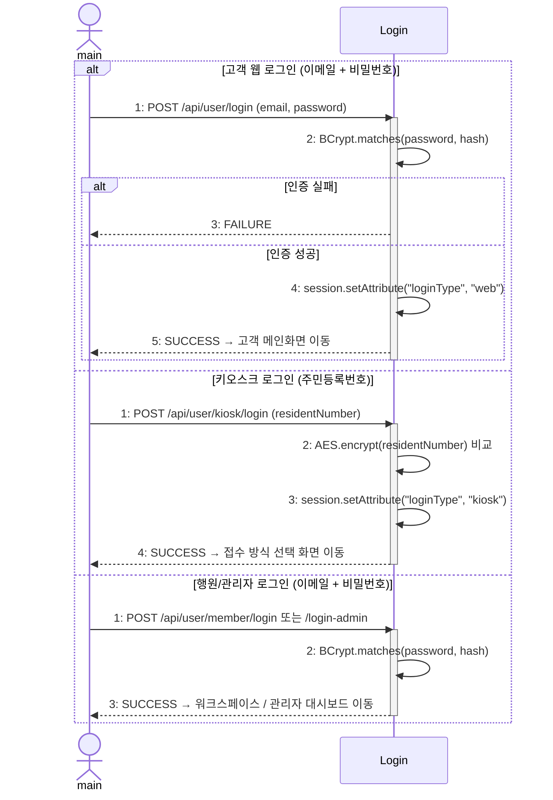

위의 그림은 시스템 실행 후 로그인 기능을 수행할 때를 표현한 Sequence Diagram이다. 사용자 유형에 따라 세 가지 로그인 경로가 존재한다. 고객·행원·관리자는 이메일+비밀번호(BCrypt 검증)를 사용하며, 키오스크는 주민번호(AES 암호화 후 비교)를 사용한다. 웹 로그인 성공 시 세션에 `loginType=web`, 키오스크 로그인 성공 시 `loginType=kiosk`를 저장하여 채널별 접근 권한을 구분한다. `kiosk` 타입 세션은 번호표 접수 기능만 허용되며, 비밀번호 변경·대출 신청·카드 발급 등 민감한 작업은 `web` 타입 세션에서만 처리된다.

### 3) AI 금융 상품 추천

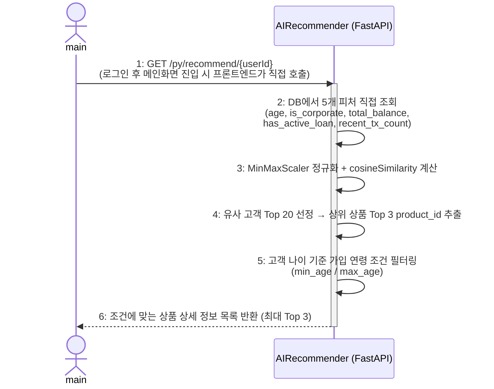

위의 그림은 고객 로그인 직후 AI 금융 상품 추천이 수행될 때를 표현한 Sequence Diagram이다. 프론트엔드가 Spring Boot를 거치지 않고 AI 서버(`/py/recommend/{userId}`)를 직접 호출한다. AI 서버는 DB에서 5개 피처를 조회하고, Cosine Similarity로 유사 고객 Top 20을 선정하여 상위 3개 product_id를 추출한 뒤 나이 조건 필터링을 거쳐 상품 상세 정보를 프론트엔드에 직접 반환한다.

### 4) AI 지능형 창구 접수 (회원)

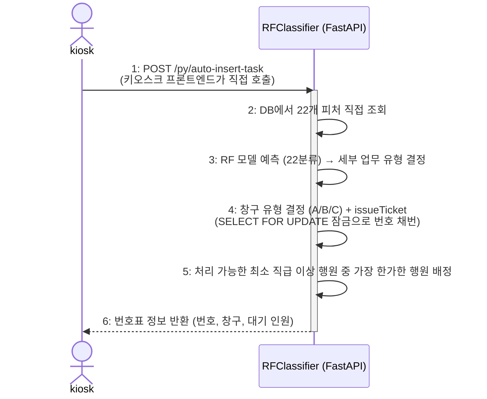

위의 그림은 회원이 키오스크에서 AI 지능형 창구 접수를 수행할 때를 표현한 Sequence Diagram이다. 키오스크 프론트엔드가 Spring Boot를 거치지 않고 AI 서버(`/py/auto-insert-task`)를 직접 호출한다. AI 서버가 DB에서 22개 피처를 조회하여 RF 모델로 예측하고, SELECT FOR UPDATE 잠금으로 중복 없이 번호표를 채번하여 행원에게 배정한다.

### 5) AI 지능형 창구 접수 (비회원)

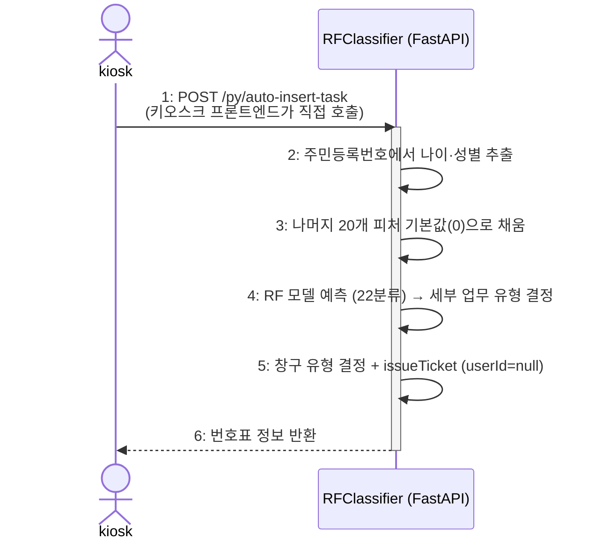

위의 그림은 비회원이 키오스크에서 AI 지능형 창구 접수를 수행할 때를 표현한 Sequence Diagram이다. 키오스크 프론트엔드가 AI 서버를 직접 호출하며, 주민등록번호에서 나이·성별 2개 피처를 추출하고 나머지 20개는 기본값(0)으로 채워 RF 모델에 입력한다. 이후 창구 배정 및 번호표 발급은 회원과 동일하게 진행되며 task의 userId는 null로 저장된다.

### 6) 키오스크 직접 접수

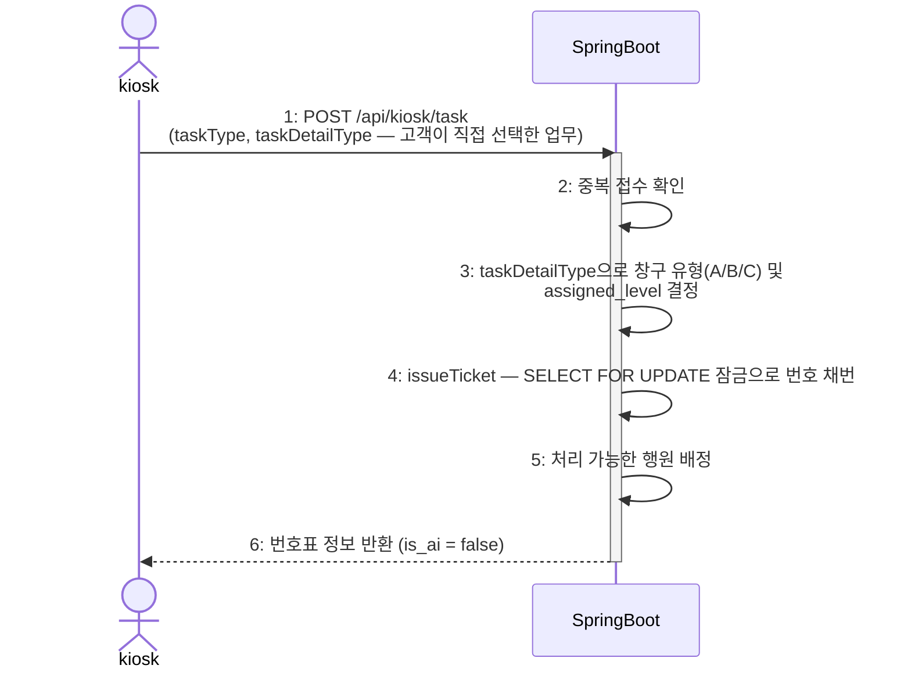

위의 그림은 고객이 키오스크에서 업무를 직접 선택하여 번호표를 발급받는 과정을 표현한 Sequence Diagram이다. 자동 접수와 달리 AI 서버를 호출하지 않고 Spring Boot(`/api/kiosk/task`)를 직접 호출한다. RF 모델 예측 없이 고객이 선택한 `taskDetailType`으로 창구 유형과 처리 직급을 결정하며, `is_ai = false`로 저장된다.

### 7) 대기열 관리 및 고객 호출

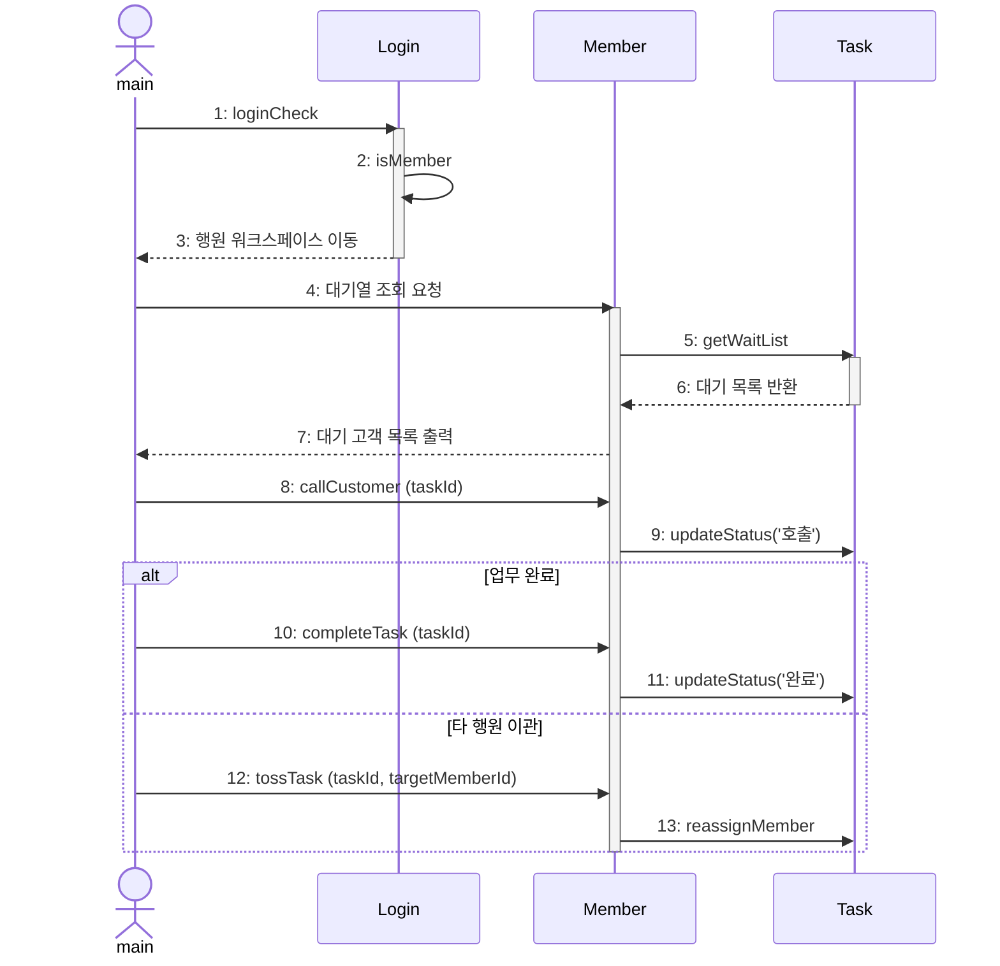

위의 그림은 행원이 로그인 후 대기열을 관리하고 고객을 호출하는 과정을 표현한 Sequence Diagram이다. 행원으로 로그인하면 자신의 창구에 배정된 대기 고객 목록을 불러온다. callCustomer를 실행하면 task 상태가 '호출'로 변경된다. 업무 처리 후 completeTask로 '완료' 처리하거나, 처리가 어려운 경우 tossTask로 다른 행원에게 이관할 수 있다.

### 8) AI 챗봇 상담

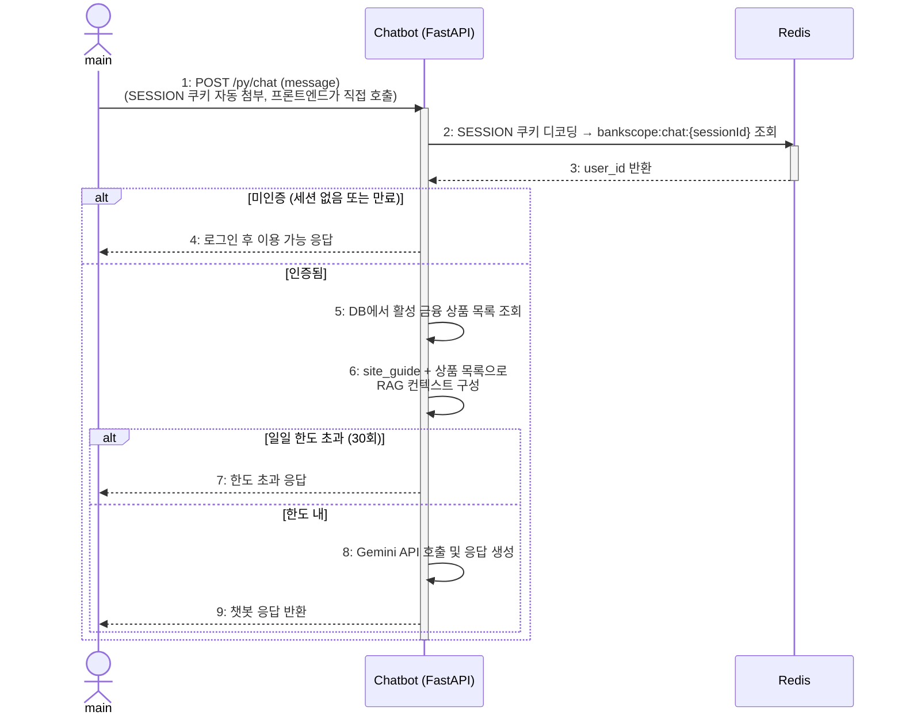

위의 그림은 고객이 AI 챗봇 상담을 이용하는 과정을 표현한 Sequence Diagram이다. 챗봇은 로그인한 회원 전용 서비스로, 프론트엔드가 Spring Boot를 거치지 않고 AI 서버(`/py/chat`)를 직접 호출한다. 브라우저는 SESSION 쿠키를 자동으로 첨부하며, AI 서버는 이를 Redis에서 조회하여 user_id를 추출한다. 미인증 요청은 즉시 거부되며, 인증 성공 시 DB에서 금융 상품 목록을 조회하고 site_guide.txt와 결합하여 RAG 컨텍스트를 구성한 뒤, 일일 한도(30회) 확인 후 Gemini API를 호출하여 응답을 프론트엔드에 직접 반환한다.

### 9) 관리자 상품 관리

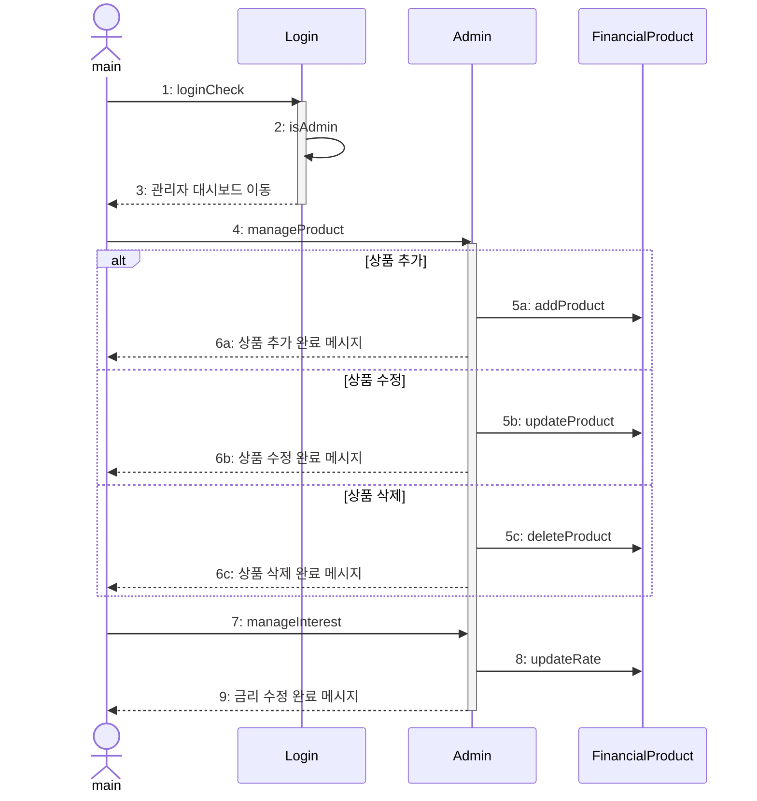

위의 그림은 관리자가 로그인 후 금융 상품을 관리하는 과정을 표현한 Sequence Diagram이다. 관리자로 로그인하면 대시보드에서 금융 상품 관리 기능을 수행할 수 있다. manageProduct를 통해 상품을 추가·수정·삭제할 수 있으며, manageInterest를 통해 개별 상품의 금리를 별도로 수정할 수 있다.

---

## 4. State machine Diagram

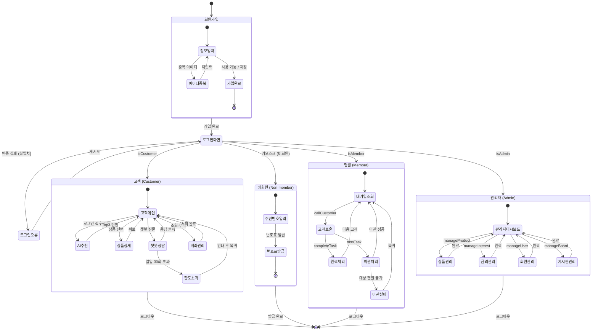

회원가입 후 로그인을 통해 권한에 따라 사용할 수 있는 기능이 나뉜다. 고객 권한은 AI 금융 상품 추천, 상품 상세 조회, AI 챗봇 상담, 계좌 조회·이체, 키오스크 창구 접수를 수행할 수 있다. 비회원은 키오스크에서 주민등록번호만으로 번호표를 발급받을 수 있다. 행원 권한은 대기열 조회, 고객 호출, 업무 완료 처리, 타 행원 이관을 수행할 수 있다. 관리자 권한은 금융 상품·금리·회원·게시판을 관리할 수 있다.

---

## 5. Implementation Requirements

### 1) H/W platform requirements
- (1) CPU : Intel Core i3 이상
- (2) RAM : 8GB 이상
- (3) HDD / SSD : 20GB 이상

### 2) S/W platform requirements
- (1) OS : Microsoft Windows 10 이상 / macOS / Linux
- (2) Implementation Language : Java 17, Python 3.10+, JavaScript (ES2022)
- (3) Framework : Spring Boot 3.x, FastAPI, Vite + React 18
- (4) Database : MySQL 8.0+
- (5) In-memory Store : Redis 7.0+ (세션 공유 저장소)
- (6) External API : Google Gemini 2.5 Flash API (Google AI Studio 발급)

---

## 6. Glossary

| TERMS | Description |
|:---|:---|
| Random Forest | 다수의 의사결정 나무를 앙상블하여 예측 정확도를 높이는 분류 모델. 본 시스템에서 22개 피처로 22가지 세부 업무 유형을 예측하는 데 사용된다. |
| Cosine Similarity | 두 벡터 간의 코사인 각도를 이용해 유사도를 측정하는 알고리즘. 고객 프로필 벡터와 유사한 고객을 찾아 금융 상품을 추천하는 데 사용된다. |
| RAG (Retrieval-Augmented Generation) | 외부 문서(사이트 가이드, 상품 정보)를 컨텍스트로 제공하여 LLM의 응답 정확도를 높이는 기법. Gemini 챗봇에 적용된다. |
| Level (행원 레벨) | 행원에게 부여되는 1~5 단계의 권한 등급. 레벨이 높을수록 기업·특수 업무 등 복잡한 업무 처리가 가능하다. |
| Toss (이관) | 행원이 담당 업무를 다른 행원에게 넘기는 기능. 관리자는 강제 이관도 가능하다. |
| SHAP | Shapley Additive Explanations의 약자. RF 모델의 예측 결과에 각 피처가 기여한 정도를 수치로 설명하는 XAI(설명 가능 AI) 기법. |
| Redis | 인메모리 Key-Value 저장소. Spring Boot와 FastAPI AI 서버의 공유 세션 저장소로 사용된다. 로그인 시 `bankscope:chat:{sessionId}` 키로 user_id를 저장(TTL 2시간)하며, AI 서버가 챗봇 요청 인증에 활용한다. |
| SESSION 쿠키 | Spring Session이 발급하는 세션 식별자. Base64url로 인코딩된 세션 ID를 담으며, 브라우저가 동일 도메인 요청에 자동 첨부한다. JSESSIONID를 대체하며 HttpOnly 속성으로 JavaScript 접근이 차단된다. |

---

## 7. References

- KB국민은행 웹페이지 : https://www.kbstar.com/
- 농협은행 웹페이지 : https://banking.nonghyup.com/nhbank.html
- 강의자료 : Structural Modeling II, Behavior Modeling I, II, III
- Scikit-learn Documentation : https://scikit-learn.org/stable/
- FastAPI Documentation : https://fastapi.tiangolo.com/
- Google Gemini API Documentation : https://ai.google.dev/
